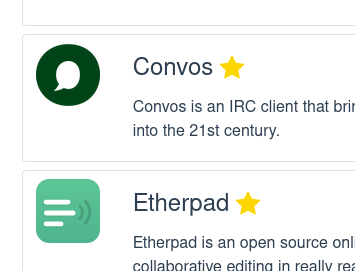

# New features for the Portal App store

⚠️ If you own a Portal, restart it now, and it will upgrade itself. (Use the settings menu on the top-right.)

When we first designed the app store, we focused on building something that works quickly. It was always meant to be a first shot that would be extended or replaced at some time. We now felt compelled to address this task.

<!-- more -->

After adding more apps over time, we observed that some can be integrated with Portal pretty well, while others cannot. A typical caveat is a registration/login flow that we cannot get rid of with configuration alone. We talked about that in the last post. Those not-so-well-integrated apps do work, however, and can be very useful. We do not want to keep them out of the store.

What we needed was a way to signal to the user which apps provide the Portal experience like it is meant to be: easy to use right away, no setup, no registration or login. We needed a way to highlight featured apps.

So that is what we implemented and while we were at it, we searched through the backlog for other ideas for improving the app store that we collected over time. The result is an app store that looks much more finished (although not quite).

And in order to support the changes, we also introduced version 2.0 of the app.json format (see the docs [here](/developer_docs/app_json/#version-10-to-version-20){target=_blank} and [here](/developer_docs/submitting/#metadata-for-the-app-store){target=_blank}). Versioning of this format was also described in the last post, and it already turned out to be very useful, making changes very easy and straightforward.

Here is the full list of changes.

👉 Featured Apps allows us to highlight apps that work particularly well. They are also sorted at the top of the list.

👉 Short and long description let us display a short text in the app list and a more verbose one on the app page.

👉 Speaking of which: the app page did not exist before. It is the place for more in-depth information about an app. We also put the Install button there.

👉 For some apps, the app page also contains a hints popup. Here, we can post important information about an app's usage or behaviour.

👉 People that are curious about such things can display the full app.json of each app.

👉 We also got rid of the tabbed view, where you could switch between the app store and the list of installed apps. Instead, we mark each installed app with a label and let you uninstall it right from its page.

While working on the improvements, we thought of lots of other things we would like to do but for which we could not take the time. So expect another future update. Also, tell us what you think and if there are other features that you would like to see.
