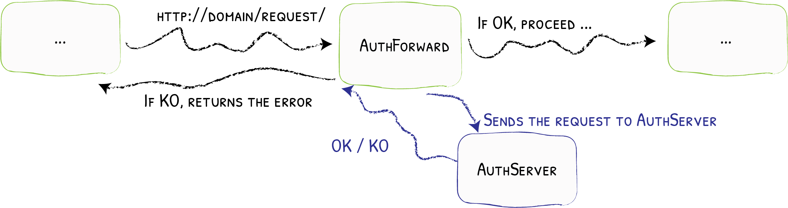
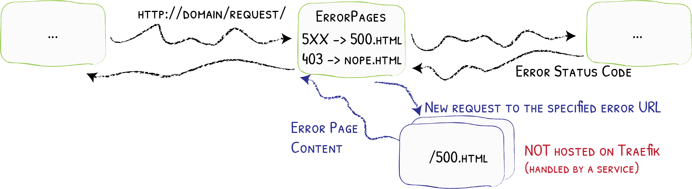

# Starting and Stopping Apps

## Rationale

Running Apps on Portal is realized through docker-compose. When you install an app, the docker-compose.yml that contains all apps is rerendered and the process restarted. This causes docker-compose to pick up the new app and to pull it and start it.

However, until recently that meant that every app you have installed is running all the time. This limited the number of installed apps severely as the bottleneck was the Portal's RAM - 1GB with the current setup.

<!-- more -->

It was important to do something about that. And the most intuitive approach is starting apps only on demand, just like you are used to on your smartphone. For this to work, we implemented several new features that work hand in hand to make this possible while maintaining a smooth user experience.

## Detecting App Usage

In order to start an app on demand, Portal first must detect when it is being used. Luckily, that is straightforward. We were already using the [Traefik forward auth feature](https://doc.traefik.io/traefik/middlewares/http/forwardauth/){target=_blank} for determining access control. The Portal Core acts as the auth server and thus gets called for all requests to all apps.

## Starting and Stopping Apps

Containers that are defined using docker-compose can still be started and stopped by issuing commands to the docker daemon. Nothing else does the Portal Core.

Whenever a successful auth request for an app hits the Portal Core, it checks whether the app is running and if not, it issues a start command. It also saves the timestamp of the request and during a scheduled task that runs every few seconds, it looks for apps that have not been used in a while and stops them in the same way.

## Splash Screens

Now that apps are not running all the time, it might happen that the user opens an app by clicking on it on the home screen and then has to wait some time until that app has been started and is accepting requests. We somehow have to bridge that time in a way that feels natural. A common practice is showing a splash screen and so that is what we implemented.

Of course, the splash screen cannot be part of the app itself because a) those are apps that we don't create ourselves and b) when the splash screen is needed, the app is not running yet. So the splash screen is hosted by Portal Core. It is a simple static document containing the app's logo (statically embedded as a data-URL) and its name. It also reloads itself every few seconds so that as soon as the app is running, the reload will open the app.

On the backend, we have to implement a kind of routing. If the app is not reachable, we want to reply with the splash screen instead. Again, we are using a Traefik feature for this. The error page middleware is originally meant to display custom error pages but since the splash screen can be seen as a kind of error page, we can use it here, too.

## Defining the Lifecycle

With all these features in place, automatically starting and stopping apps is working well. What is missing is a way for app developers to configure the behavior. Some apps start quickly and can be stopped early, others should keep running longer. Some apps should never be stopped at all.

The right place to define this is of course the app.json file. We have covered it in prevous posts and also explained the way in which its format can be versioned. Adding the lifecycle section resulted in [version 3.1](/developer_docs/app_json/#version-30-to-version-31){target=_blank}. It allows us to define the idle timeout after which an app is stopped or disable automatically stopping it at all.

In the future, we would like to include a method to periodically start the app even if it is not actively used. Some apps like ChangeDetection would benefit from that. And even further in the future, we want to enable apps to control their own stop and start behaviour by calling an internal endpoint. This is of course only useful for apps that are specifically created or adapted to Portal and we don't have those yet.

Are there any other features regarding app lifecycle management that you would like to see? Write in the comments or via email. Or even better: use our [new feedback tool](https://feedback.getportal.org/){target=_blank}!
