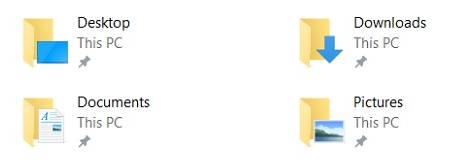
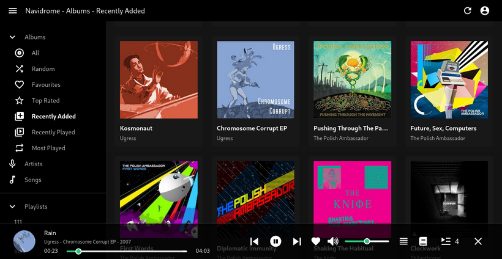
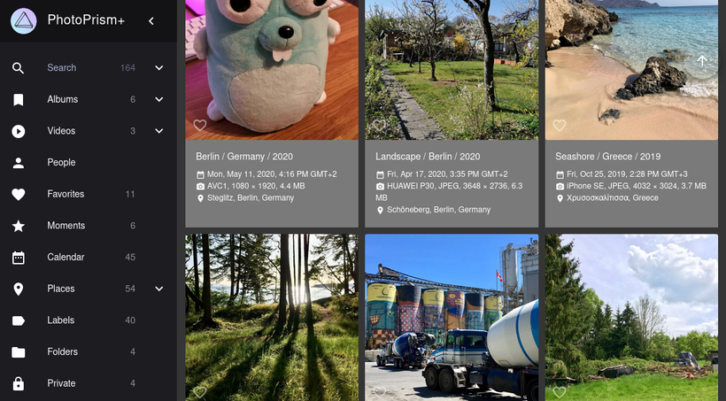

# Shared Directories

⚠️ This feature is not backward-compatible. Your current Portal must be deleted, and you need to recreate it. [Write](mailto:contact@getportal.org/) [us](https://discord.gg/ZXQDuTGcCf){target=_blank} as soon as you are ready.

Most apps that you install on your Portal need to persist data in some way. There are currently two ways they can do that: a) they request a database on the Postgres instance that is running on the Portal or b) they mount a part of the Portal's filesystem.

<!-- more -->

Both options isolate the data of each app from those of all other apps and the Portal itself. The database is exclusively used by the app and directories are mounted from an app-exclusive subdirectory. This prevents any sharing of data between apps and ironically mirrors the way SaaS products are working today - one data-silo per application. We find that pattern annoying and don't want it to be repeated on Portal.

If you look at basically any operating system, you will not find this kind of data-silos. There is a filesystem and application can use it to freely read and write files. This gives the user much more freedom and control, so with Portal we do something similar.

The feature is called "shared directories" and it is described in detail [in the documentation](/developer_docs/persisting/#shared-directories){target=_blank}. In short, we have added a few directories that are meant to be shared between apps.

An app can request access to one or more of them and Portal will mount them into the Docker container when starting the app. Changes made by one app are seen by all other apps that have the directory mounted.

This also allowed us to bring a few new apps to the store that were previously blocked by the missing feature. [Navidrome](https://www.navidrome.org/){target=_blank} is like a selfhosted Spotify for all your music and [Photoprism](https://photoprism.app/){target=_blank} lets you view and organize all the photos and videos that you make. In addition, the good old [Filebrowser](https://filebrowser.org/){target=_blank} can now access all shared directories, so you can use it to view and edit their file structure.

We are planning to release more apps that can take advantage of shared directories. [Tell us](https://feedback.getportal.org/){target=_blank} if you can think of any that you would like to see.
