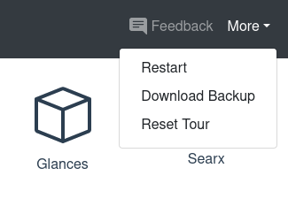

# Backup your Portal

This is a big one! Since from the start, we told everyone that Portal is in an early prototype stage. Your data is not safe, and it could get lost at any time. Technically, this is still the case, but now it is possible to download a full backup of all of your data whenever you want.

<!-- more -->

Simply open the "More" dropdown (formerly "Settings") and select "Download Backup" and the download will start.

The backup is a zip archive that contains all the data that makes your Portal unique like its internal database, all the documents or media you uploaded, and the state of all of your apps. Feel free to open and explore the archive.

⚠️ Careful: inside the archive is also your Portal's unique identity (the technical term is "private key"). Don't share it with anyone, or they could impersonate your Portal!

## Why is this feature so important?

### Readiness for productive use

With the backup feature in place, people can finally use their Portal productively which means for more than just testing and demonstration purposes. They can be sure that their data will not be lost as long as they regularly download their backup.

And if something happens to their Portal, the backup can be used to create an identical replacement. (Although that process is not automated yet.)

### Building trust

We always emphasize that Portal works for the user and only for the user since they are the customer. A part of that is preventing vendor lock-in and let people leave Portal whenever they want and take everything with them. With the backup feature, this is trivially easy. There is no proprietary technology in a zip archive.

In fact, if you are more tech-savvy, you could spin up the apps that you use on your Portal on your own hardware, mount their state from the Portal's backup and just keep using them locally, just as you left them. So the user is always in full control.

## Future Work

The backup feature in its current form is a first shot that works for now. But there is much more to be done. A small example: to prevent people from forgetting to do a backup, we will [add a regular reminder](https://feedback.getportal.org/posts/7/remind-people-regularly-to-download-a-backup){target=_blank}.

But in the long term, we want [backups to be fully automated](https://feedback.getportal.org/posts/4/automatic-backups){target=_blank}. Every night (or at another interval) they should be pushed to a cloud storage (encrypted, of course), where we keep them safe and allow the user to download them whenever they want. After all, one of Portal's promises is to be fully managed.

If you have other ideas or wishes for backups or for Portal in general, please participate on our [feedback platform](https://feedback.getportal.org/){target=_blank}.
