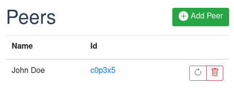
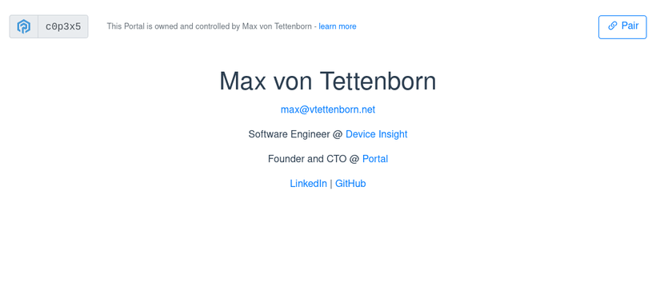
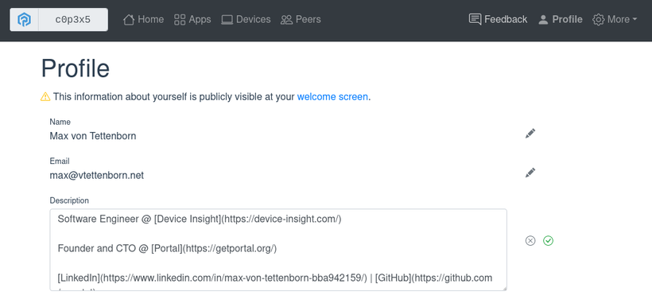

# Peer-2-Peer Communication

It has been some time since our last update here on Patreon. For one thing, we have been busy with lots of smaller tasks - both technical and regarding business development - that do not really warrant a blog post. Some of them made it into our newsletters though. But another reason for the long silence is the next big feature which was a particularly tricky and time-consuming one: peer-2-peer communication.

<!-- more -->

From the start, a core part of Portal's vision was the ability to connect Portals in order to form a P2P and decentralized network. Conceptually, this is similar to all social networks which allow you to maintain a list of contacts or friends. But where centralized platforms like Facebook, Twitter, etc. still control all the data and see all connections, Portal makes good on its promise of sovereignty. Your peers (which is the term we chose to use) are stored on your Portal - so your private domain - and Portals talk directly with each other, without a middleman.

Of course, all communication is end-to-end encrypted and authenticated: a neccessary requirement for privacy. This is made possible by using the [IETF HTTP Message Signatures draft standard](https://datatracker.ietf.org/doc/draft-ietf-httpbis-message-signatures/){target=_blank} which is not often used in normal consumer-facing services where annoying passwords are the norm. However, with Portal's unique features, it is a good fit. Each Portal always has a cryptographic identity (that is where its 6-digit ID is derived from), so it has all the material to sign requests. And since its owner uses the same Portal from all their devices, sharing of private keys (which is a terrible idea anyway) is not needed. It really drives home the point that a Portal is its owners identity on the internet.

With the new feature in place, an app can now get a list of peers and send http requests to them. The sender Portal adds a signature to the request and the receiver portal verifies it. With each Portal having a valid certificate anyway, this results in an encrypted and mutually authenticated channel.

Since the feature is brand new, no app uses it yet. It will be the task of app developers to modify their apps for that purpose.

You can read more technical details in [the documentation](/developer_docs/peering/){target=_blank}.

## Personal Profile and Welcome Screen

When managing peers, it is important to have real names associated with them, not just the Portal IDs. That means that a Portal's owner should have a way to enter their name such that it is displayed in their peers' contact list. So we had to implement this feature as a requirement for peering but we also took the opportunity to add a related feature that realizes another important aspect of Portal: a public page/welcome screen.

We often describe Portal as a user's identity on the internet. Their avatar or representative. With Portal's unique combination of properties this makes sense: it is always on and online and owned and controlled by the user and noone else. A first step toward that goal is giving each Portal a public face. Something to present to people that enter the Portal's address. Until now, you would only see the pairing screen.

Now, there is a public page that you can fill with text using Markdown syntax. You can describe yourself or your projects, add links to other online profiles and so on. It can be used to tie your whole internet presence together at a single point.

We are looking forward to seeing how people use this feature! As always, for any questions, use our [Discord server](https://discord.gg/ZXQDuTGcCf){target=_blank} and for feature requests or other feedback, here ist the [feedback form](https://feedback.getportal.org/){target=_blank}.
