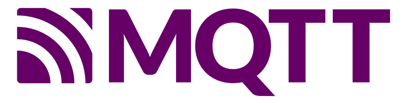
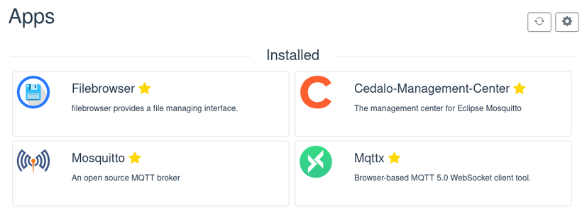

# Smart Home and IoT

Recently, we were made aware of some smart home appliances that use MQTT to talk to a backend in order to publish data or receive commands. This backend can be freely configured, it just needs a MQTT broker.

<!-- more -->

We were thinking: in theory, with its unique set of features, Portal is a great match for such devices and should be able to play the role of the central hub that manages, monitors, automates, etc.

Portal is private which is important when you use it to send and store measurements from your home since this data can be intimate. Portal is easy to use, so it lowers the bar for the often already pretty technical process of setting up smart home appliances. And it is accessible from anywhere and from any device which gives you a maximum of freedom while interacting with your smart home.

So over the last few weeks, we set out to make that possible. We started with a simple first goal: have Portal run a MQTT broker and let users configure it easily.

## New Apps

New functions for Portal are of course best implemented as apps that the user installs. We chose Mosquitto as the MQTT broker and Cedalo Management Center as a convenient interface for managing the broker's access control rules. Both apps are now available in the app store.

## Entrypoints Feature for Portal Core

For Mosquitto to be reachable from the internet via MQTT, it must be possible to map the MQTT port (8883) into the Mosquitto container. Until now, Portal only supported mapping a single http port per app, so there was need for an extension.

We changed the app.json format such that instead of defining a single port, you can now define multiple entrypoints and set the protocol (and thus the exposed port) for each one. The change is described in the [updated documentation](/developer_docs/app_json/#version-32-to-version-40){target=_blank}. The mosquitto app is the first one to make use of that feature.

## Guides for Common Tasks

Even with single-click install apps, the actual setup of your devices is still a process that takes some steps. In particular, managing client credentials and permissions is a task that cannot be skipped while retaining reasonable security. So in order to help people along, we wrote a [short step-by-step guide](/user_guides/smart_home/){target=_blank} that covers installation, setup, and a simple smoke test.

This is the first of many guides we plan to add to our new User Guides section of the documentation.

## Conclusion

This is the first step towards establishing Portal as a valuable part of smart home and IoT. We already planned next steps like enabling more apps that can help you automate, monitor, and control.

If you experiment with the new feature (or if you don't) we would love to hear your thoughts on them. Every kind of feedback helps us improve. You can [write us](mailto:contact@getportal.org/) or use [our feedback platform](https://feedback.getportal.org/){target=_blank} or chat with us directly on [our Discord server](https://discord.gg/ZXQDuTGcCf){target=_blank}.

Looking forward to hear from you!
