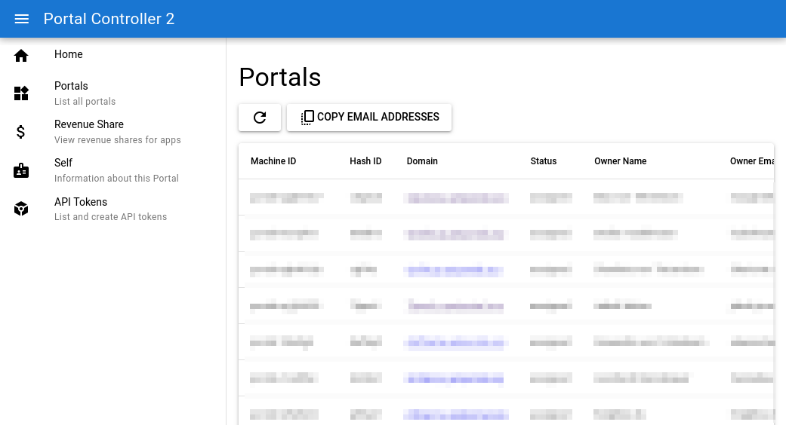
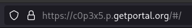
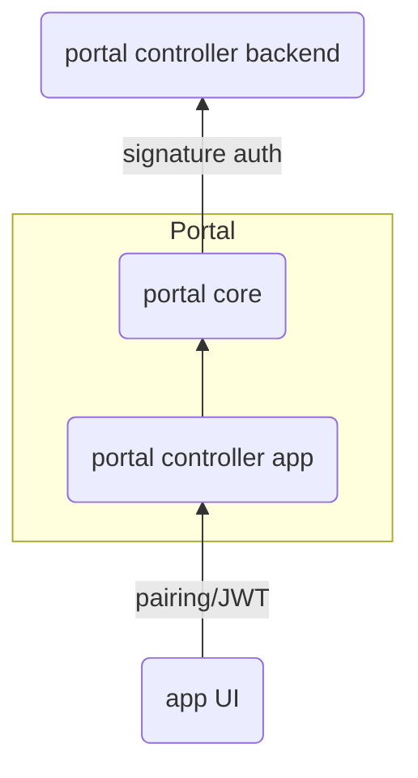

# Eating your own dog food

The Portal ecosystem is more than the software that runs on the Portals themselves,
it also consists of a bunch of administrative functions.
Among others things, they 

* create, assign, upgrade, and remove Portals,
* manage Portal resources,
* monitor Portal health
* accept and process payments,
* receive and process app usage reports for [revenue share](/developer_docs/revenue_share).

Until now, these tools were accessed using a command line interface, 
but with increasing complexity I decided that it is time for something graphical.

There is the saying "[Eat your own dog food](https://en.wikipedia.org/wiki/Eating_your_own_dog_food){target=_blank}", which means that you should use the products that you create.
So the new graphical interface became a brand-new Portal app.
And it really shows the simplicity Portal can provide if used correctly.

<!-- more --> 

## Portal Controller Backend

The new app for interacting with the backend services is called "Portal Controller".
It comes with a new backend developed specifically for this app
which, for the start, implements some of the functionality that became important recently.
The portal controller backend is a Python app with a REST API built using [FastAPI](https://fastapi.tiangolo.com/){target=_blank}
and hosted using Azure Container Apps.
This is a departure from the existing backend based on Azure Functions
which - after the honeymoon phase was over - turned out to be too cumbersome to work with.
The aim is to migrate all functionality to the new backend and retire the old one although that may take some time.

At any time, there is exactly one instance of the backend running, but it has no public web UI.
Instead, it offers a REST API
which is specifically built to be called by the new Portal app.
And here, Portal's features regarding identity and authentication really shine.

## Portal Controller App



In general, every Portal app can be divided into two parts:
the backend logic running on each individual Portal and the frontend running in the user's browser.
In the case of the portal controller app, the bulk of the logic is in the frontend.
The backend is very simple.
Its only purpose is to serve the frontend and to redirect calls the frontend makes to the `/api` endpoints to the portal core running on the Portal itself.

What's up with that redirection? To understand that, let me remind you of a few facts about Portal's concept of identity.

* Every Portal has a unique identifier, the Portal ID. You can see it as part of the URL and in the top left corner of the Portal UI.
* The Portal ID is connected (i.e. is a hash) to its [private/public key pair](https://en.wikipedia.org/wiki/Public-key_cryptography){target=_blank}.
These are cryptographic keys the Portal can use to prove its identity over the internet.
You can look at my Portal's public key [here](https://c0p3x5.p.getportal.org/core/public/meta/whoareyou){target=_blank}.
* The portal core can make requests to other hosts on the internet and sign those requests with the Portal's private key, which means the receiver can verify that the request was made by that Portal and not by someone else.
* The user's devices (Notebook, Smartphone, etc.) have a pairing with the Portal, which is a [JSON Web Token](https://jwt.io/) that is signed by the Portal's private key.

<figure markdown="span">
    
    
    <figcaption>The Portal ID in the address bar and the web UI.</figcaption>
</figure>

Taken all of that together means that **there is absolutely no need for a Portal user to even think about authentication**.
As you can see in the following diagram, requests from the app UI to the portal controller backend 
are authenticated by the normal pairing mechanism on their way to the app,
then the forwarding mentioned above happens, where the request goes to the portal core.
There, it is signed with the Portal's private key and then sent to the portal controller backend.
The backend can now verify the signature and without a doubt identify the Portal that made the request.



What happens here is a small glimpse of the vision I have for Portal
and why every Portal has this seemingly random ID.
It allows every Portal to cryptographically prove that it is the owner of its ID
without any human interaction.
No passwords, no "Login with _something_", no nothing.

What I want for the future is that:

1. Portals can talk _to each other_ in the same way - end-to-end encrypted and authenticated, and
2. that apps make use of this feature to provide a seamless experience for the user.

## What does the Portal App really do?

I mentioned that the backend of portal controller app (the one running on each Portal, not the one in Azure) is very simple.
It serves the frontend and forwards requests to the portal core.
In fact, it really does not contain any code at all but is based on a nginx image with a custom configuration which is so small, I can show it here in its entirety:

```nginx
http {
  include /etc/nginx/mime.types;

  server {
      listen 80;
      server_name localhost;

      location /api { ## (1)!
          rewrite ^/api/(.*)$ /internal/call_backend/api/$1 break;
          proxy_pass http://portal_core;
      }

      location / { ## (2)!
          root /usr/share/nginx/html;
          index index.html;
      }
  }
}
```

1. This is the part that forwards requests to `/api` to the portal core, where a special endpoint accepts calls, applies the Portal's signature, and forwards them to the backend.
2. This is the part that serves the frontend which is just static HTML, CSS, and JavaScript files created with [Quasar](https://quasar.dev/){target=_blank}.

What is elegant about this setup is that the frontend can just make calls to `/api` and that way directly interact with the backend on Azure.
It does not have to care about the portal core and authentication at all which reduces the mental load for the frontend developer significantly.

## Authorization

Until now, I have only talked about authentication, which is about proving who you are.
Equally important is authorization, which is about what you are allowed to do.
So after the portal controller backend has identified the Portal that made a request, it has to decide if the request is allowed.
How does it do that?

There are many methods to do authorization, for now I have chosen a simple one, based only on a list of permissions that are directly assigned to Portal IDs.
This is an excerpt from the database entry of my own Portal:

```json
{
    "hash_id": "c0p3x5wgkav3qfcya7y7lh69kyze03hpfc693gzyzy3apls95nzz8zh24k3wqw9ajcv5vwrqw2a5lw6qy55vy6z4e9dlwhfl3544ls2",
    "domain": "c0p3x5.p.getportal.org",
    "owner": "Max von Tettenborn",
    "permissions": [
        "list_portals",
        "read_portal",
        "modify_portal",
        "delete_portal",
        "read_revenue_share",
        "modify_revenue_share"
    ]
}
```

The real entry has more fields, but this is the relevant part.
As you can see, I have the permissions to list, read, modify, and delete Portals and to read and modify the revenue share.
These are all the permissions that the portal controller backend currently knows about.
With more features, more permissions will be added.

When the time comes to involve more people in the administration of the Portal ecosystem,
I can simply assign the necessary permissions to their Portals.
This instantly enables them to use the portal controller app to do their work.

Though in the long term, this simple system will likely have to be replaced by something like [RBAC](https://en.wikipedia.org/wiki/Role-based_access_control){target=_blank}.

## Backends for other Apps

Of course, the portal controller backend knows all existing Portals from the start, it is the one that creates them.
Other apps that want to offer a backend with the described kind of authentication 
would have to create entries for Portals at the time of first contact.
That would be no problem at all, every signed request from a Portal also contains the Portal ID.

Importantly, this, too, would be totally transparent to the user.
Using a Portal to interact with any kind of backend can always be implemented in a way that the user does not have to think about it.
The backend just always securely recognizes the Portal.

??? note "Implementing this in your own app"
    In the portal controller backend, I used the library [requests-http-signature](https://pypi.org/project/requests-http-signature/){target=_blank} to verify the signatures.
    However, it assumes that you already have the public key of the sender, 
    which in this case, you have to get by calling the Portal's `/core/public/meta/whoareyou` endpoint.
    So you would have to do this in your `HTTPSignatureKeyResolver` class.
    Also, if you want to write asynchronous code, you would need to make extra steps, because the library does not support it.
    If you are struggling, feel free to [ask me for help](mailto:max.von.tettenborn@getportal.org) - I went through those struggles already.

## Conclusion

When talking to people about the vision of Portal, I often say that ones Portal should be ones digital twin, or ones representative on the internet.
That only works if it has a consistent identity by which it can be recognized by other online entities -
just like we have our appearance and our name by which we are recognized by other people in the real world.

With the current system of identity in place, there is no more need for passwords or other methods that require user interaction.
I hope that one day, we will look back and shake our heads in disbelief about the trouble we once had to go through.

!!! note ""
    Can you see the value of seamless authentication?
    Would you like to build your own Portal app that takes advantage of that feature?
    Discuss at the [Portal Discord](https://discord.gg/ZXQDuTGcCf) or tell me your thoughts via [email](mailto:contact@getportal.org).
