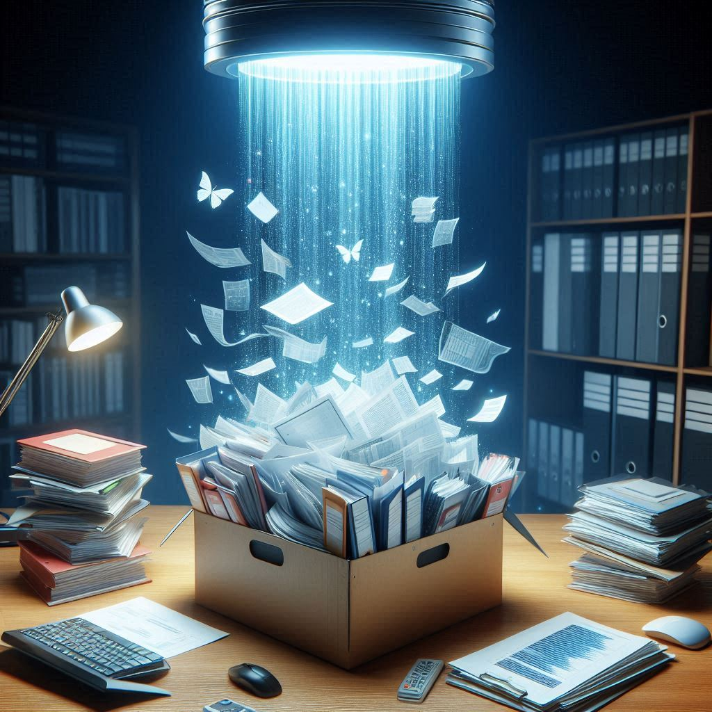
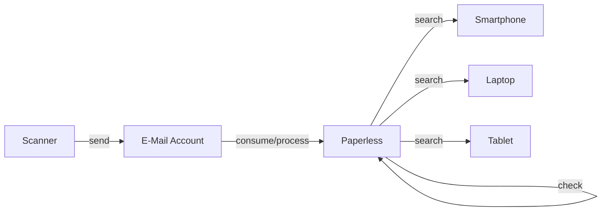
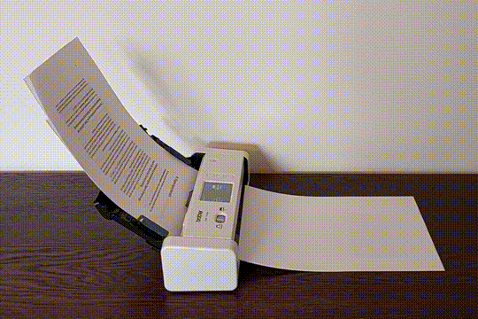
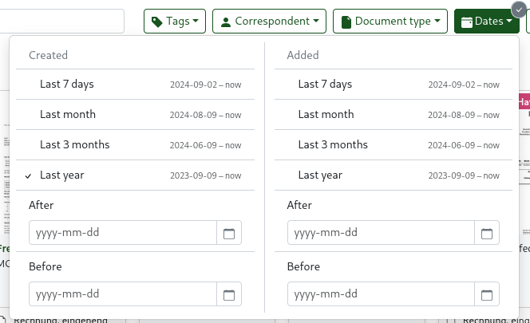
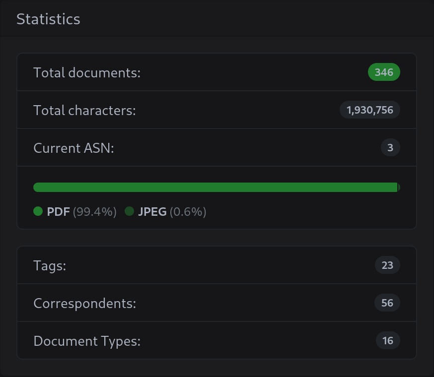

# Going Paperless with Paperless on Portal

One of the most useful Portal apps is Paperless.
Especially in countries like germany, where paper still plays a big role in everyday life,
Paperless can help you stay on top of your documents and keep your desk and shelves clean.
After optimizing my setup for the last few weeks,
I have arrived at a point I would consider (almost) ideal.
In fact, it is almost fun to scan and organize documents now.
Let me walk you through it.

{ width="500" }

<!-- more --> 

## Why use Paperless?

The need to manage documents is pretty universal in the modern world (sometimes frustratingly so) and there are many ways to do it.
You could keep the paper in ever-growing binders or boxes. 
You could scan them and store them on your computer. 
Or put them in a cloud service like Dropbox or Google Drive.
Many people probably do a combination of these things.
But they all have their downsides, like the time it takes to scan and organize documents, the risk of losing them, or the privacy concerns of storing them in the cloud.

Paperless on Portal is a way to get rid or at least significantly reduce these downsides.
With a proper setup and its smart features, it makes organizing fast and effortless.
Since the documents are kept and processed only on Portal, 
they are always available and secure and automatically backed up as well as under your exclusive control (like everything on your Portal).
To my knowledge, there is no other service that offers this combination of features.

Here, you can also see exactly the three main hallmarks that make up the DNA of Portal itself: simplicity, ubiquity, and ownership.

## Overview

In a nutshell, my Paperless workflow looks like this:

1. I scan all incoming documents and trash the originals.
2. The scanner directly sends the scanned documents to Paperless on Portal via a dedicated email address.
3. Paperless automatically processes the documents: it extracts text, categorizes the document (date, type, correspondent), and applies tags.
4. Then, I manually look over the consumed documents in Paperless and correct any mistakes.
5. Once organized, I can search for documents on any device using the Paperless web interface.

Let's now go into more detail on each of these steps. If you want, you can also [create your own setup](#try-it-yourself) and follow along.

## Scanning

For fast and easy scanning, I use a duplex feeder scanner but of course, if you are patient, a flatbed will do the trick.
Mine is the _Brother ADS-1700W_ which is small and light and chews through a stack of paper in no time.
It is a delight to use and I can highly recommend it.

The scanner connects to my Wi-Fi network and has a feature to send scanned documents directly to an email address.
I have saved this as a shortcut so the scan takes a single tap.
The email address it sends to is a dedicated one that I created just for this purpose.

!!! note ""
    Here, I set up a dedicated email account just for incoming documents.
    However, you can also use your existing email account if you prefer and have Paperless only consume mails from a specific sender or with a specific subject.
    In the future, we want Portal to host its own mail server so you can even skip this step.

## Consuming

This email account is monitored by Paperless. Once a minute, it checks for new mails and 
consumes all mail attachments as new documents.
So I can scan a document, and it will be in Paperless within a minute.
I sometimes forward emails with attachments I want to keep to this address, so they end up in Paperless as well.
And if I have a document lying around in the filesystem, I can just upload it using the web interface.

Connecting Paperless to the email account works in the same way you would connect a mail client like Thunderbird or Outlook.

Once the email account is set up, you can create rules that tell Paperless how to process incoming emails.
In this case with a dedicated email account, I only need a single rule that consumes all email attachments and then deletes the email.
A nice trick is to add the `consumed` tag to all documents.
That way, I can easily filter for documents that I have not yet checked.

## Organizing

Paperless is able to extract text from the documents and categorize them on its own based on the content.
After a bit of automated learning, it gets quite good at this so
most of the time, there is no need for me to correct anything.

Nevertheless, with the help of the `consumed` tag, I still double-check every document manually.
After verifying and correcting any mistakes I remove the "consumed" tag.
This usually takes only a few seconds for each document, so no effort at all.

Some people might need to get used to not having folders in which to put their documents.
In Paperless, all documents are in a single list instead and the organization is done with their metadata and filters.
This is actually more powerful and flexible.

If you think about it, folders are just a way to organize documents by category, something that tags can do as well.
So instead of putting a document in a folder called _apartment_, you can just add the tag _apartment_ to it.
In fact, tags are more flexible than folders because a document can have multiple tags 
but if you want a document to be in multiple folders, you have to make copies of it.
For example, a tax-deductible bill for your apartment can have the tags _apartment_ and _tax_.

??? note "What if I need to keep the original?"
    There are some especially important documents of which you just have to keep a physical copy.
    For these, Paperless has a special feature: the _archive serial number_ (ASN).
    The idea is this: you still scan the document and manage it in Paperless, but you also keep the physical copy.
    In order to find the copy quickly, you assign it an ASN (in Paperless and on a post-it on the original) 
    and put all your copies in a binder in order of the ASN.
    When searching the original, you first search inside Paperless, look up the ASN, 
    and use it to find the physical copy by doing a [binary search](https://en.wikipedia.org/wiki/Binary_search) in the binder.

## Searching

Thanks to this metadata, searching for documents is easy and powerful.
I can filter the list of documents by date, type, correspondent, or tags.

For example, when the yearly tax declaration is due, I can filter by type _invoice_ and date _last year_ and have a good first selection of documents to include.
Usually, it turns out that some of the invoices are not relevant, so I refine the filter by removing those _correspondents_ from the list.
In just a few minutes, I have a complete list of all relevant documents.

Another powerful feature is the fact that I now have all of my documents accessible from any device.
I mentioned this before, but it is worth repeating.
Imagine being at a governments office or somewhere similar, realizing you need a document that is at home.
That just won't happen anymore.

## Conclusion

There is no need to digitize all of your documents at once.
About a year ago, I just started with the new documents that came in and that has been very helpful already.
Digitizing old documents is still on my todo list, but it is not urgent.

{ width="400" }

The benefits of going paperless are already clear: less clutter, easier organization, better accessibility,
and - most importantly - more free time that is not spent organizing and searching for documents.

## Try it yourself

I hope this article has inspired you to give Paperless on Portal a try.
If you want, you can start with a free trial.
(Once you have your Portal, [write us](mailto:help@getportal.org) so we can unlock the needed Portal size for you.)

[:sparkles: Create Trial Portal](https://trial.getportal.org/?apps=paperless-ngx){ target=_blank .md-button .md-button--primary }

And if you have any questions or need help with your setup, feel free to join the [Portal Discord](https://discord.gg/ZXQDuTGcCf){ target=_blank }.
