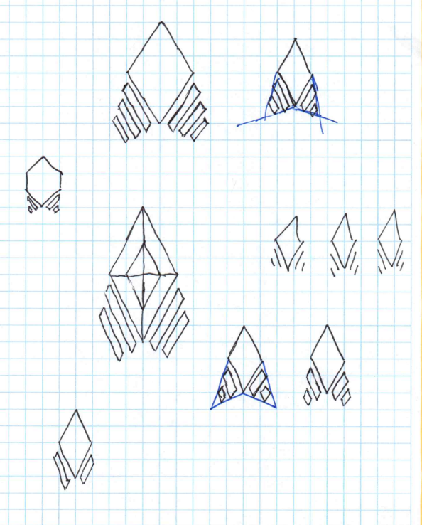

# Rebrand and Public Source Code

The brand _Portal_ was always meant to be a placeholder, one that felt increasingly stale lately.
So I did some brainstorming and sketching and came up with a new name and logo.
From now on, Portal will be called:

{ width="500" }

<!-- more --> 

## About Portal

To be totally honest, I came up with the name _Portal_ after playing the Valve game with the same name.
At the time I really had no good name for the project and Portal felt kinda ok: short, easy to remember.
I did not know how serious all this was going to be, so the bar for branding was pretty low.
A collaborator later found the logo on a stock image database.
So it was all a bit low-effort, just to have something.

Of course the name Portal has its problems.
It is a very common noun, one that is even more commonly used in the IT area.
That makes it hard to find a domain name - getportal.org is unwieldy and the _.org_ TLD doesn't really fit - and search engines won't place it prominently.
It is also weird from a semantic point of view:
A portal is like a door, a gateway, leading to somewhere.
Where does the product _Portal_ lead? Nowhere, really.
It is more like a destination, a thing in itself.

So all this did not fit and after a long time deprioritizing the rebranding this feeling just grew and grew until I finally put the task on the table.

## About Freeshard

Coming up with a new name - a new identity really - still took quite some time.
This was a creative process and such a process cannot be rushed.
So from time to time I revisited the task, tried to come up with other words and meanings, only to drop it again, waiting for the next sprint of inspiration.

Some of the ideas I wanted to convey were stability/homeliness/intimacy/faithfulness, freedom/independence/self-control, value/uniqueness.
I played around with variations and translations of words like _one, avatar, daemon, deck, hub/center_ and others.
In the end, it became _freeshard_, and I am pretty happy with it.

Freeshard is actually a known term, albeit only in the bubble of old-school online-games.
When someone who is not the publisher of a game hosts their own game server - with or without the publisher's permission - this is called a freeshard.
So the aspect of self-hosting and individual freedom is right there in the traditional meaning of the word.

Also, the term _shard_ is reminiscent of a piece of a gemstone, hinting at stability, value, and uniqueness.
However, a shard is only a single piece and many shards make a consistent whole.
This is a good analogy for the project, where the peer-to-peer connections of shards will eventually turn individual tools into a much more useful ecosystem.
In fact, I decided that I'll call the individual instances _shards_.

So all these thoughts went into the name and make it a good fit.
The cherry on top then was the fact that the freeshard.net domain was free - perfekt.

Next task: creating...

## The Logo

I started sketching and doodling whenever I felt like it.
With the term _shard_ as part of the name, I wanted to make some kind of gem-like faceted structure but also include a certain technologyness.
Here are some of the sketches, the final design evolved surprisingly quickly.
It just kinda made sense.

The simplicity with only two angles for the outlines, the symetry, the "shardiness".
It reminds me of a rocket taking off but the lines can also be seen as wireless transmission signs like in the wifi symbol.
Or you see the central element as a shard and the small elements as its paired devices.
If I sqint real hard, it even reminds me of the Starfleet logo.
All of this was not planned of course, but it is always nice if you can make up origin stories for your logo after the fact.

## Move to GitHub and Fair Source

While I was already modifying the project all over the place for the rebranding, it makes sense to tackle other big changes at the same time, right?
No, it does not, in fact it goes against all recommendations for software development, which somehow does not prevent me from [doing it anyway](../2023-09-16_app_integration_overhaul/main.md).

Your shard is supposed to be your _home on the internet_ (as per the tagline), a place you can trust.
A tiny, unknown startup company offering an online service is not really the best way to build that trust though.
But when you show people the source code of the product, even let them host it themselves, things are different.
So that is the next obvious step for freeshard.

Unfortunately, for publishing source code _GitHub_ really is the most popular and widely used service in town, by a huge margin.
And Portal was hosted on Git**Lab**, so it had to move.

That move was surprisingly not as easy as I anticipated.
An org and some repos are created quickly but rewriting the CI/CD pipeline took some more effort 
and making the code ready to be published and easy to run for everyone who wants to try it even more so.
Until that point, Portals only existed as their fully managed variant, a much more forgiving context.

And then there is the license.
I am not sure yet, if I chose the right one using a [functional source license](https://fair.io/licenses/){ target=_blank } 
but at least I think I did not shoot myself in the foot with it, and that is something.
Maybe it will change in the future.
As of now, I am glad people can read the source code and host their own shards which will hopefully help build trust
and at the same time, I am the only one who may build a commercial service out of freeshard. 

## Conclusion

So that was another huge change for the project.
It feels more mature now, although the basic functions are still the same.
I am hoping now for a community to evolve with all its unforeseeable and chaotic and productive side effects.

You can find the GitHub repo [here](https://github.com/FreeshardBase/freeshard){ target=_blank }. Give it a star if you like.
Try to run it locally, it should only take a few minutes, [here are the steps](https://github.com/FreeshardBase/freeshard?tab=readme-ov-file#localhost){ target=_blank }.
If you run into problems or have an idea for a feature, [open an issue](https://github.com/FreeshardBase/freeshard/issues){ target=_blank }.

Managed shards are not available yet, but they will come soon.
In the meantime, you can still [try](https://trial.getportal.org/){ target=_blank } or [buy](https://getportal.org/#subscribe){ target=_blank } a managed Portal (which is still essentially the same thing.)

Hope you have a good time with it, and I am looking forward to your comments at [Discord](https://discord.gg/ZXQDuTGcCf){ target=_blank } or via [email](mailto:contact@freeshard.net).
