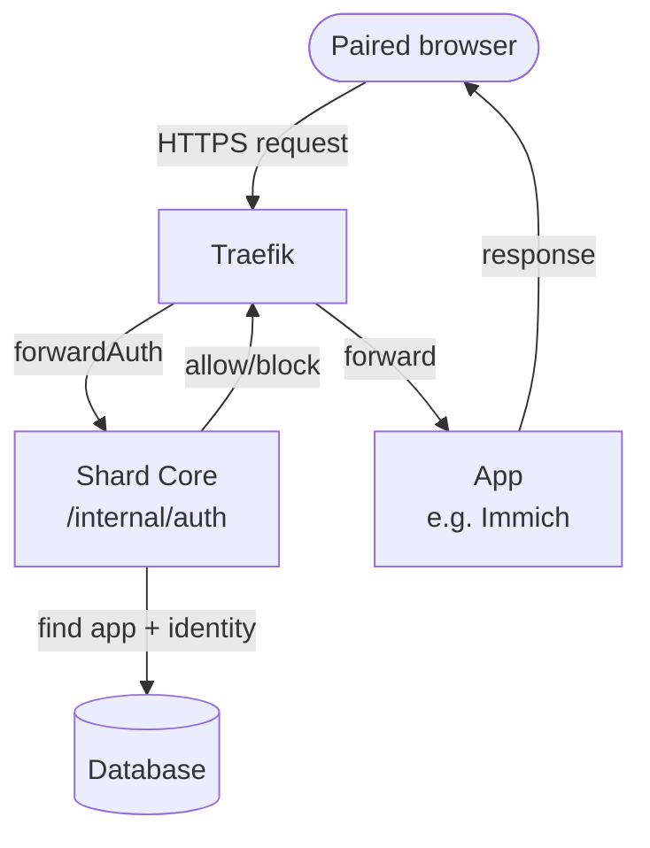

# Unblocking Apps by fixing a Performance Bottleneck

For a while now there was a problem with the Immich app. On the web it did not start most of the time. If it did, it was painfully slow to start and to load images. Curiously, the mobile app did work. I had been meaning to fix that app in particular, but did not get around to it. But a few days ago, a pass over all the apps to upgrade them revealed the actual problem. It was the same problem that plagued other apps and made them slow, for example KitchenOwl. These apps did work, but they were no fun to use. Long waiting times between action and reaction made them just feel sluggish.

<!-- more -->

## How requests travel inside a Shard

Every request that hits a shard goes through Traefik first. It is then decided whether that request may pass on to the app or is blocked. All requests from paired devices may pass on as well as requests that target a public endpoint. This is decided by the shard core application. And that means every request gets forwarded by Traefik to that application where the decision needs to happen. It is like a bouncer who has to check your ID for every single sip of your drink, not just once at the door.

In order to make that decision, the shard core needs to query a few bits of information. What kind of app is targeted? How is its permission model configured? What device is requesting access? This is all in the database, so the database needs to be queried. And to query the database, a database connection is required. This connection is not created each time, but pulled from a pool of connections that are standing by and can be used and then returned to the pool.

## The Bottleneck

As it turned out, each single request pulled two connections from the pool to answer the question of whether it is allowed or must be blocked. Also the pool had only four connections available at a time. This is the default setting and I never questioned it, I did not even consciously see it. But when an app opens 30 or 40 requests on its first start, only the first two can be served right away. All the others are waiting for database connections to be returned and then given out again. A whole bunch of requests block for a long time. The crowd piles up behind the rope while the bouncer works through them two at a time.

In fact, for apps like Immich or Actual, which open lots of connections during their startup, the long tail of piled-up and waiting requests frequently hit the 45-second browser timeout and the app fails to load at all.

Debugging that problem was especially tricky because those blocked requests never hit the running application. The browser just gave up on them after they took too long. In the application logs, nothing could be found. There just was no real detectable error happening. It was just a performance degradation that had the effect of an unresponsive application. But none of the observable side effects of real exceptions.

## The obvious fix is insufficient

Now, the first instinct would be to increase the database pool size from its default of 4 to something like 20. This would immediately make it possible for many more requests to be served at the same time. However, this just moves the goalposts and apps that make even higher request bursts would still hit a similar problem. Also, getting a connection from a pool, using it to query the database and returning it is not free, there's also a latency involved in that which would still be added to every request. So there must be a better way.

After taking a look at what is actually queried from the database for each request, the solution became pretty clear. Because the information needed was not something that changed very often. It is the identity of the shard and the requesting device. And it is the metadata and state of the app. Those fields do not change in milliseconds or seconds, but rather in minutes, hours or days. So, they can be cached. But of course, whenever you cache something, you need to think about invalidating the cache which is often described as one of the two hard problems in computer science next to naming things and off-by-one errors.

## Blinker-Signals

Quick side note: shard-core uses a simple signal-bus based on the [Blinker](https://blinker.readthedocs.io/en/stable/){ target=_blank } library. A signal is just an object that can be invoked and subscribed to. When it is invoked, it calls all of its subscribers and that way the invoking function does not need to know what those subscribers are. In cases where a signal must be invoked from multiple different locations, this can reduce an n-to-n complexity (each caller calling all consumers) to two one-to-n complexities (n callers to one signal, one signal to n consumers).

I included the system in shard-core because I found it conceptually elegant at the time, but after working with it, it turned out to not really be needed that much (the n being mostly small) and being its own source of problems and complexity, so I considered for quite a while to remove it and just do the calls directly.

But to get back to the cache invalidation problem, this is where the signal-bus really came in handy. It allowed me to set up caches that invalidate themselves based on a signal they receive: at every point where the cached data is modified, a signal (like `on_apps_update` or `on_identity_update`) is emitted that notifies consumers of that modification. The cache invalidator is just one of those consumers. So now the mutation sites do not even know about the cache.

Thanks to the ease of this fix, which was due to the existing signals, I am now leaning again toward keeping them.

## The result: zero database connections

With the cache in place, the number of database connections on the hot path of every request is now at zero. The effect on the apps is stunning. They load quickly, they are fun to use. With Immich, I almost cannot scroll fast enough to see the thumbnails loading.

The patch added 60 lines of code and removed 25. And it transformed a painful experience into a fun one. And that without changing the UI or requiring complicated setup or migration or anything. Really good efficiency. Really good effect for that small of a change.

My two key takeaways are these. 1. Performance and speed is not a soft target. It is not nice to have. It can fundamentally change the experience. I've seen a talk by Linus Torvalds when he first introduced Git and the audience at Google (using SVN) didn't get it, but he was right. And this fix was a really good reminder. 2. Database connections and queries, even if the database is on the same host, add a significant overhead. If you do too many on a hot path, it will add up and be noticeable.

The update is already deployed on all existing and future shards. If you have one, maybe revisit apps you found slow before and try them again. If you don't have one, you are invited to a free 24-hour trial [here](https://freeshard.net/en/trial/){ target=_blank }.
