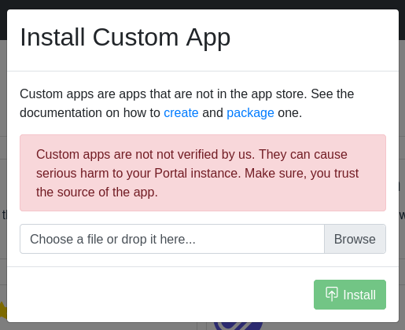

If you have a personal app that you don't want to submit to the app store,
or if you want to test an app before submitting it to the app store,
Portal lets you install it directly as a custom app.
You can also let others install it this way.

---

The files that make up your app's metadata are described in the [Overview](overview.md#the-apps-metadata).
These are the files you need to place in the app store to make you app available to others as described in [Submitting an App](submitting.md).

* The `app_meta.json`
* The `docker-compose.yml.template`
* The icon file (optional)

In order to install you app directly, circumventing the app store, 
you need to create a zip file containing these files and upload it to the Portal.
Make sure that the name of the zip file exactly matches the name of the app as it appears in the `app_meta.json` file.

Navigate to the Apps page, open the *Tools for app developers* menu, and select *Install Custom App*.
This will open a dialog box where you can upload your zip file.

After uploading the zip file, the app will be installed normally as if it had been submitted to the app store.

Of course, you can also send the zip file to others, allowing them to install and test your app the same way.
Since the zip does not contain the app itself, it is very small and can easily be sent by email or other means. 
