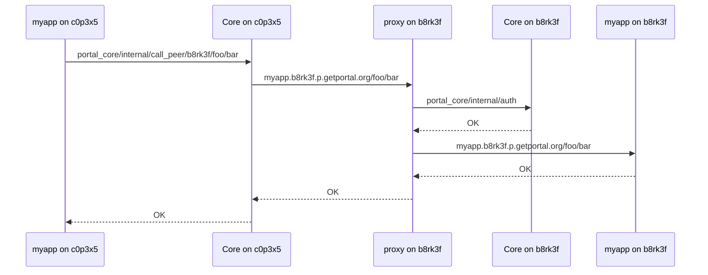

# Peering

A Portal's owner can enter other Portals' IDs in order to peer with them.
This allows apps to establish end-to-end encrypted and authenticated communication
between itself and another instance of the same app that is running on a peer.

---

## Overview

### Rationale

Each Portal is a single-user platform and so each app that runs there is owned by a single user.
This is in contrast to typical SaaS platforms which often include a user management
and service many users at once.
But of course many applications benefit from or completely rely on multiple users accessing them,
e.g. chat/messaging, collaboration, social, sharing, etc.

In order to allow such use-cases on Portal while maintaining the privacy and sovereignty
that is at the core of its value, apps must be able to exchange data in a peer-2-peer manner.

### Portal's role

Portal allows apps to send http requests to another instance of the same app that runs on a peer.
It takes care of these concerns:

* Managing the list of known peers and their basic information (ID, name)
* Sending signed http requests to peers on behalf of apps
* Verifying signatures of incoming http requests before forwarding them to apps

Each app must take care of these concerns:

* Querying known peers and enriching them with app-specific metadata if needed (ACLs, privileges, etc.)
* Implementing the business logic for sending and receiving requests to and from peers
* Adding the necessary entries in the `app.json` to configure access control and get needed information on each incoming request

In particular, it is important for each app to implement a symmetric endpoint for each call it makes.
If it calls a peer with a POST to `foo/bar`, it must listen to POST requests from other instances at `foo/bar`.

## Portal IDs

Each Portal has a unique and random ID.
You can think of it like the Portal's phone number (although it is alphanumeric).
You can see the first six digits of your Portal's ID on the home screen and as part of its URL.
The real ID is much longer, but you rarely need it.

Every Portal also maintains a contact list containing the IDs of other Portals,
which we call peers.
You can modify this list, e.g. add your friends' Portals.

When a Portal communicates with another Portal, both Portals must have added each other as a peer.
Then, the nature of the IDs makes sure that all communication is authenticated and end-to-end encrypted.

## Access Control

When writing your `app.json` file, you can limit access to certain URL-paths to peers only.
And you can let Portal add http headers to any incoming request that identify requests coming from peers
and include the peer's id and name.
You can also combine these features.
This allows you to open parts of your app for peer-2-peer communication.
For more details see the section about [Routing and AC](routing_and_ac.md).

## Listing Peers

In order to send data to a peer, your app must first request the list of peers that the host-Portal knows about.
This is achieved by sending an internal request to the Portal Core at `http://portal_core/protected/peers`.
See the [API docs](https://ptl.gitlab.io/portal_core/#tag/protected/operation/list_all_peers_protected_peers_get) for details.

## Sending a Request to a Peer

Once the desired peer and its ID is known, your app can send http requests to it.
However, it cannot send the requests directly, because then,
the receiver Portal cannot authenticate the sender.
Instead, the request must be sent through Portal Core which adds the necessary authentication.

Consider the app `myapp` that would like to send a `GET` request to the path `foo/bar`
on a peer Portal with the ID `b8rk3f`.
The complete URL is `https://myapp.b8rk3f.p.getportal.org/foo/bar`.
However, to have Portal add authentication, your app must instead send the request to
`http://portal_core/internal/call_peer/b8rk3f/foo/bar`.

### Sending Sequence

When sending a request to a peer, this is the sequence that it follows.

* `Core on c0p3x5` adds a signature to the request
* `proxy on b8rk3f` accepts the request and decides about routing
* `Core on b8rk3f` verifies the signature and decides about access control according to the configuration in `app.json`
