As a developer of Portal-apps, you automatically earn money from people who have your app installed.
The revenue share scheme aligns incentives in a way that works best for everyone.

---

Portal's revenue share scheme for app developers aligns incentives in a way that works best for everyone.
App developers receive a monthly payment that scales with the number of installed app instances
and users have no additional cost when installing apps, so they are not discouraged from doing so.
The process is also very low-effort for both parties with regard to setup and maintenance.

## Payment and Decision Flow

The revenue share scheme consists of the following steps that are executed each month.

### 1. App Flatrate

Part of each user's monthly subscription fee is a flat app payment of a few euros.
This fee is mandatory and constant.
For the customer, it is simply part of the subscription fee.
Assume for this example a monthly app fee of 3.00€.

### 2. App Usage Monitoring

During each month, the Portal monitors which apps are installed and for how long.
Assume the following distribution where App 1 is installed for the whole month
and at the middle of the month, App 2 was uninstalled and App 3 was installed instead.

```mermaid
gantt
    dateFormat  DD
    axisFormat  %d
    todayMarker off
    
    App 1       :   app1, 01,30d
    App 2       :   app2, 01,15d
    App 3       :   app3, 16,15d
```

### 3. Weight Calculation

At the end of the month, Portal uses this information to calculate a weight for each app
matching the relative time it was installed.
In the example, it would look like this:

| App   | Weight |
|-------|--------|
| App 1 | 50%    |
| App 2 | 25%    |
| App 3 | 25%    |

### 4. Manual Adjustments

!!! warning "Upcoming Feature"
    The option for manual adjustment is not yet implemented.
    Users cannot change the weights yet and its implementation - when completed - might differ from this description.

The user is notified of the calculated weights and can now make adjustments.
Maybe they want to boost an especially good app, e.g. App 3.

| App   | Weight | Boost | Boosted Weight |
|-------|--------|-------|----------------|
| App 1 | 50%    |       | 37.5%          |
| App 2 | 25%    |       | 12.5%          |
| App 3 | 25%    | ⭐     | 50%            |

### 5. Splitting the Flat Fee

The user-adjusted weights are sent to the Portal backend and are used to split this month's app fee.

| App   | Weight | Boost | Boosted Weight | Revenue Share |
|-------|--------|-------|----------------|---------------|
| App 1 | 50%    |       | 37.5%          | 1.125€        |
| App 2 | 25%    |       | 12.5%          | 0.375€        |
| App 3 | 25%    | ⭐     | 50%            | 1.5€          |

### 6. Sum Up and Payout

For each app, the revenue share from all Portals is summed up and added to the app developers account,
ready to be withdrawn at any time or sent automatically to their bank account.

## Incentives

This scheme creates beneficial incentives for all involved parties.

### For App Developers

As an app developer, you have an incentive to build apps that are useful or delightful to many users.
If they install it, you are compensated.

But since you are compensated each month for as long as users keep your app installed,
you profit from continuously maintaining and updating your app.

In addition, you profit more the fewer other apps a user has installed.
This is the case if your app covers many use-cases and is versatile.

### For Portal Users

As a Portal user, your flat app payment is a constant and mandatory part of your Portal's price tag.
There is not a single additional thing you must do to enable it.
And no matter how many or few apps you use, you always pay the same amount.

This makes paying for apps a nobrainer.
It means that you can install and try apps as much as you want without a second thought.

But if there is an app you particularly like, you can give it a boost
and allocate an additional share of your flat payment to that app.
