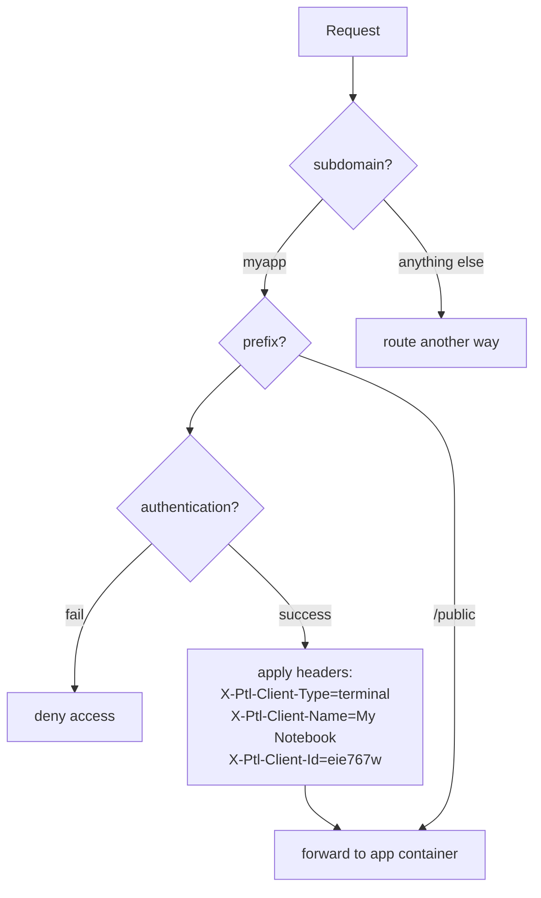
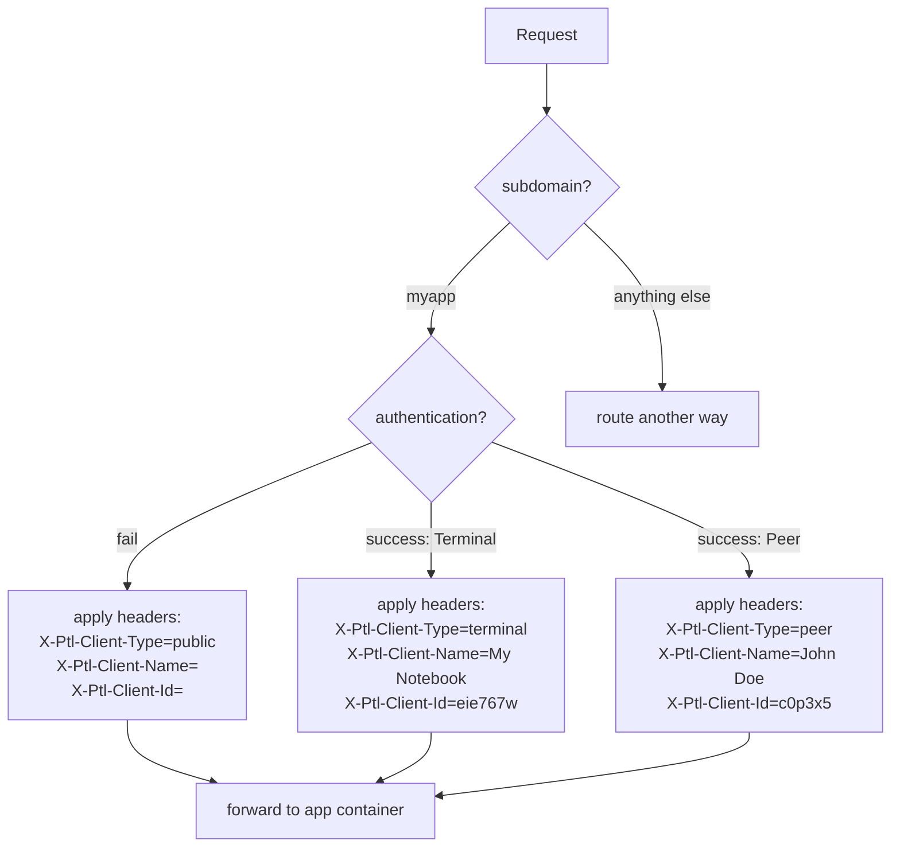

# Routing and Access Control

Incoming requests for your app are routed and authenticated by the Portal software 
according to your configuration in `app.json`.

---

## Routing

Each Portal has a unique URL containing its random six-digit identifier, e.g. `xyz123.p.getportal.org`.
Each app is reachable at a subdomain of that URL, e.g. `myapp.xyz123.p.getportal.org`.
Requests to this subdomain are forwarded to the running docker container of that app.

## TLS

As an app developer, you do not need to concern yourself with TLS and certificates.
Your app only needs to expose one or more arbitrary ports.
Portal manages its own certificate that is valid for all of its subdomains
which means it covers all of its installed apps as well.

## Access Control

Portal is not only authenticated against incoming requests with its certificate.
It also authenticates the sources of those requests - if configured to do so - and applies access control.
By using the `paths` section in the `app.json`, you can choose
which path prefixes should have which type of access
and what should be the default access type.

!!! warning "HTTP only"
    This kind of access control is only applied to entrypoints of the type `http`.
    Entrypoints of the type `mqtt` are *public* by default, and you have to add your own access control mechanism. 

Path prefixes are evaluated against the path of the incoming request from longest to shortest.
The first matching prefix is chosen and its access is applied to the request.
You _must_ include the empty string `""` as the default option that is evaluated last. 
There are three types of access that you can use:

* *public* means no access control; anyone can access this path.
* *private* means that only paired devices may access this path; these belong to the Portal's owner.
* *peer* means that other Portals that have been added as peers may access this path.

After authentication, if the request is forwarded, Portal adds headers to the request that you defined for that path.
You can use them inside your app for more fine-grained access control or other logic.

When defining the headers, you can use template variables contained in Jinja-like double curly braces.
Available variables are:

| variable           | description                                    | example                             |
|--------------------|------------------------------------------------|-------------------------------------|
| `auth.client_type` | The type of client that sent the request       | `terminal` or `peer` or `anonymous` |
| `auth.client_id`   | The cryptographic ID of the Terminal or Peer   | `eie767`                            |
| `auth.client_name` | The user-assigned name of the Terminal or Peer | `my notebook`                       |

In addition, you can use all variables that describe the Portal itself.

{!developer_docs/includes/template_vars_portal.md!}

## Examples

### Path-based AC

If your app's path schema naturally distinguishes public and private parts by their path prefixes,
then defining access control like described above may be a suitable approach.
You just have to define the default access and the paths that should be private/public.

Consider an app named *myapp* which has the `path` section in the `app.json` configured like this:
```json
"paths": {
  "": {
    "access": "private",
    "headers": {
      "X-Ptl-Client-Id": "{{ auth.client_id }}",
      "X-Ptl-Client-Name": "{{ auth.client_name }}",
      "X-Ptl-Client-Type": "{{ auth.client_type }}"
    }
  },
  "/public/": {
    "access": "public"
  }
}
```

This would lead to the access control behavior visualized below.



### App-specific AC

If your AC needs are more complex, you might want to implement the required logic yourself.

By choosing app-specific AC, you instruct the Portal to let all incoming requests reach your app
but still populate the http headers with IDs and names of clients.
This allows you to know for each request from which kind of client it originated
and if applicable from which specific terminal or peer.
Based on that information, you can make arbitrarily complex access control decisions.

Consider an app named *myapp* which has the `path` section in the `app.json` configured like this:
```json
"paths": {
  "": {
    "access": "public",
    "headers": {
      "X-Ptl-Client-Id": "{{ auth.client_id }}",
      "X-Ptl-Client-Name": "{{ auth.client_name }}",
      "X-Ptl-Client-Type": "{{ auth.client_type }}"
    }
  }
}
```

This would lead to the access control behavior visualized below.


