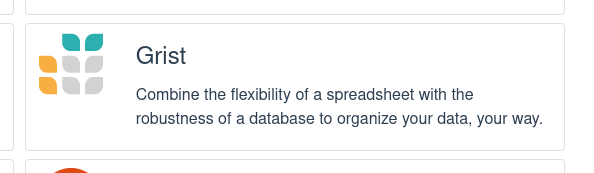
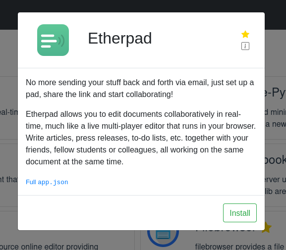
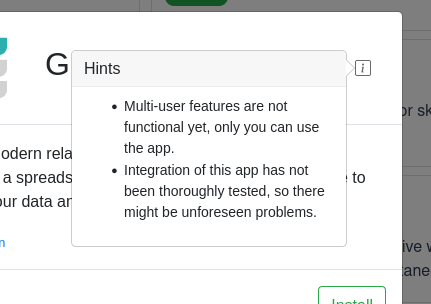

When your app is ready and tested, you can submit it to be listed in the freeshard app store.
This allows all other freeshard users to find and install it with a single click.

---

## Submission Process

The backend of freeshard's app store is [this repository on GitLab](https://gitlab.com/ptl-public/app-repository){target=_blank}.
There is a folder for each app containing the `app_meta.json`, the `docker-compose.yml.template` and the app's icon.
To submit your app, request contributor access to the repository
and create a merge request in which you add the folder for your app.
Obviously, you may not modify any other apps except your own.

When committing your changes, please name your branch `app/<your-app>`.

If you make changes to your app you should update the app's files, 
commit them to the same branch, and submit another merge request.

## Metadata for the App Store

```json
  "store_info": {
    "description_short": "A great app",
    "description_long": [
      "A really great app that serves as an example.",
      "It also has a description that is two paragraphs long."
    ],
    "hint": [
      "This app is not really part of the app store",
      "In fact, this app does not really exist"
    ],
    "is_featured": true
  }
```


The `store_info` section of the `app_meta.json` file contains metadata about your app that is displayed in the app store.
Please provide at least a short description in the `description_short` field.
Try not to make it longer than one or two sentences. It should fit on the app card in the apps list.



If you want, you can fill the `description_long` field with a more verbose text.
Provide a string or a list of strings. The latter is displayed as multiple paragraphs.



Sometimes the user should be aware of some things about your app.
For that purpose, you can fill the `hint` field.
Again, add a single string or a list of strings. The latter is displayed as bullet points.



Please do not add the `is_featured` flag. That is something, we will do ourselves.
