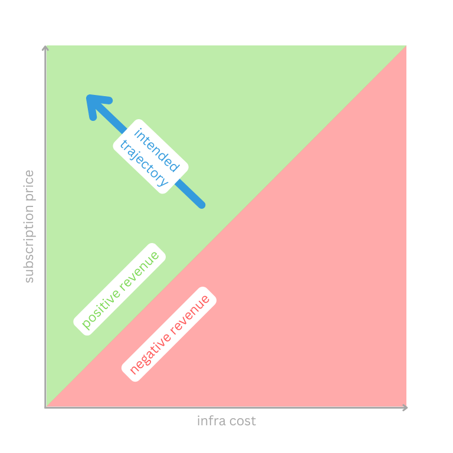
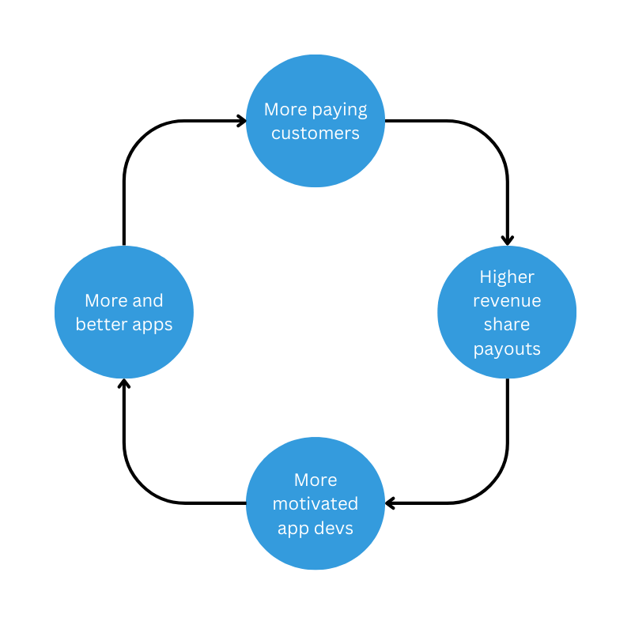

# Business Model

Advertising has evolved into the business model of the internet. When people expect their web services to be free and setting up a payment process is seen as a major hurdle, there is not much else you can do as a company to cover your costs. And it turns out that once you intimately know your users, you are in a unique position to influence them.

But in recent years, the damage this does became more obvious and well-researched. And people are more willing to actually pay for a good service. There are now many web applications operating on a subscription model. This might be due to privacy concerns. Surely, another part of the reason are services like PayPal, Google Pay, or Apple Pay that offer a smooth experience around the actual act of paying.

This is good news for Portal in multiple ways. Firstly, Portal also is a subscription service so customers’ willingness to pay in general means that paying for Portal is at least not an outlandish idea. Secondly, a single Portal is in a position to replace multiple web applications at once because of its ability to install the right app for any use-case. This could actually be a money-saver for some owners who currently pay for each application separately.

{ width="500" }

## Subscription price vs infrastructure cost

Portal users pay for their Portal on a monthly basis, around €15 for the smallest version right now, but that might change as we learn more about the willingness of customers to pay for the service. More performance and storage cost extra and a yearly payment gives a discount. This is all standard practice.

Over time, Portal will become more useful and versatile as more apps populate the app store and more core features are added. It might be feasible to increase the price proportionally. That might happen naturally as people use their Portal for more things and buy more storage and larger-sized Portals. This accounts for the upward trajectory in the graphic above.

We use the monthly payment to buy the infrastructure on which each Portal is running. There is a range of options available to us which will be becoming practical in stages over time.

1. IaaS providers like MS Azure let us provision the VMs backing each Portal right as we need them, priced individually and only for as long as we need them. There is practically zero overhead or up-front investment involved, so we can pay as we scale.
1. Reserved instances on IaaS providers let us commit to VM usage for one or multiple years in advance. This drastically reduces the price but we have to take the risk of paying for unused reservations if demand for Portals goes down. This is best combined with customers who also commit to longer-term plans.
1. Renting bare metal from IaaS providers and managing the VMs on top for ourselves is cheaper than renting the VMs but only if we can sufficiently utilize it and it introduces the management overhead.
1. Colocating one or more complete racks of hardware in a datacenter is cheaper than renting bare metal but now, we also need to take care of the hardware.
1. Building our own datacenter is the cheapest option per Portal but we probably need hundreds of thousands of subscribers to utilize it and it is a huge undertaking.

From stage to stage, the cost per Portal goes down but initial investment and risk go up. This accounts for the leftward trajectory in the graphic above.

Taken together, the revenue per Portal is bound to increase over time.

## Revenue share with app devs

Monetizing applications on the web has never been very straightforward for lone developers or small to medium development teams. There are several options and they all have significant downsides.

* Including ads allows the app to be free of additional charges but users usually pay with their data and attention and we discuss above what that can lead to.
* Letting users sign up for monthly plans works only for applications that are really valuable to the user and need to be used continuously instead of once or seasonally. Also, implementing management and payment logic is some effort.
* Selling apps for a one-time payment only yields recurring revenue with constant growth.

Portal offers another kind of revenue model to app developers: revenue share. In short, it works like this.

* Part of Portal owners’ monthly subscription payment is a mandatory app flatrate. They need not even be aware of it.
* Each Portal collects installed and used apps for each month and reports them to the backend (not before allowing the owner to censor the list, for privacy reasons) where it is anonymized and stored.
* The app flatrate of each Portal is split among the apps that the Portal reports.
* For each app, the splits from all Portals are summed up and that amount is paid to the app developer. 

This mechanism is fully automatic and provides many benefits for all involved parties.

* Portal owners need not worry at all about app costs.
* Portal owners can freely install any app they like since each additional app is always free - it does not incur additional cost.
* App developers need not worry about payment processes.

With revenue share in place, we expect a virtuous cycle to occur, where the number and quality of apps and the number of Portal users drive each other up, as displayed below.

{ width="500" }

