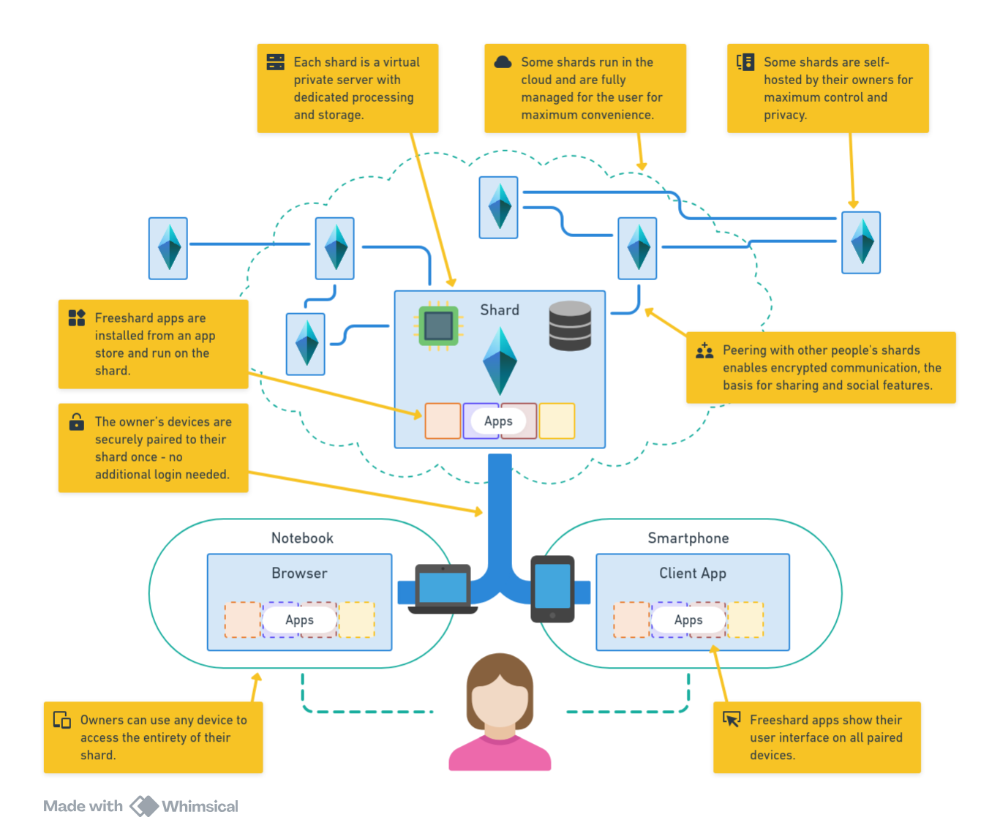

# Freeshard

Most technologies have first been a tool for professionals before they became a tool for consumers.
Cloud computers have not yet made this transition:
they are used by professionals all the time, but only indirectly by consumers.
However, a _personal cloud computer_ would have a lot to offer if it can be made simple enough.

With current technology, this can be achieved easily.
Freeshard is this cloud computer for consumers.

---

The benefits of a personal cloud computer are:

* A **single place** for all your data and applications.
* Accessing all data and applications from **anywhere, any device, any time**.
* An **always-on** and **always-online** personal server.
* The **privacy and security** of dedicated and owned infrastructure.

Current modes of using computers and the internet can roughly be categorized into three general types:

_Local applications_ run on a single device, store their data on that device, and are bound by its capabilities (storage, processing, batteries, network connection)
They cannot be used for hosting anything with any reliability.
And if you want to use them on another device, you are out of luck.

_Web services_ run on a remote server and are accessed through a web browser or a dedicated app.
That makes them reliably available on any device.
However, their data is stored on the server, which means you have to trust the provider.
And the data is locked-in in a silo, which means you cannot open it with other applications, and it is generally hard to move it.

Finally, there are _self-hosted applications_.
They solve the problems mentioned above, but they require considerable technical knowledge for setup and maintenance.

|                       | freeshard | local | web services | self-host |
|-----------------------|-----------|-------|--------------|-----------|
| Cross-Device          | ✅         | ❌     | ✅            | ✅         |
| Always available      | ✅         | ❌     | ✅            | ✅         |
| Reliable hosting      | ✅         | ❌     | ✅            | ✅         |
| Easy hardware scaling | ✅          | ❌      | ✅             | ❌          |
| Privacy               | ✅         | ✅     | ❌            | ✅         |
| Raw data access       | ✅         | ✅     | ❌            | ✅         |
| Simplicity            | ✅         | ✅     | ✅            | ❌         |

## How it works

## Developing for freeshard

When developing a freeshard-app you need to think a little differently about it compared to web-apps, desktop applications
or mobile apps.
A freeshard-app has a unique combination of features and paradigms.

As it runs on a shard which is a virtual machine on cloud infrastructure,
it has the benefits of the cloud:

* your app can be always on and always online, which is great for serving content like a blog or continually monitoring
  something like sensor readings,
* your app is present on all the user's devices, so you can create a cross-device experience, making it equally mobile
  for a smartphone and complex for a desktop computer or even combine and sync multiple devices in new and unique
  workflows,
* your app keeps its single source of truth on the shard.

However, since a shard is a single user's private space, a freeshard-app also has aspects of a local application:

* each running instance serves a single user, there is no user management,
* there is a local file-system on the shard that belongs to the user and your app can use it to persist data,
* the infrastructure that runs your app is already there, you don't need to think about hosting.

## What freeshard does for you

The freeshard core software stack that manages the whole shard including your app
already does a lot of things for you.
Things that usually you would have to do yourself.
For example:

* Encryption and certificates
* User management and authentication
* Contact lists/friend lists
* Hosting
* Backups
* Compensation/Payment

## Technology

Freeshard is not rocket science.
We use lots of established technology, not only to make our own lives easier and development quicker
but also to make freeshard more reliable and secure
and to make your life as a freeshard-app developer simpler:
you have to learn only very few new concepts to get started.

A freeshard app is published as a Docker image containing a web server that listens for HTTP and serves the static and
dynamic content that makes up your app's GUI.
The HTTP endpoint is routed and authenticated by freeshard, so there is no need to concern yourself with that.
When a user installs your app, it will be available at a subdomain of the user's shard: `<app-name>.<shard-URI>`.
It will only be accessible from the user's paired devices.

Giving your app more capabilities is easy. You
can [request a part of a shard's file-system](../developer_docs/persisting.md)
or [add views that are public or only accessible to peers](../developer_docs/routing_and_ac.md)
or [listen and react to shard-wide events](../developer_docs/events.md).
