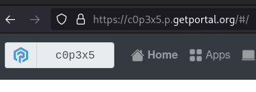

# Peering

A Portal's owner can enter other Portals' IDs in order to peer with them.
This allows end-to-end encrypted and authenticated communication.

---

!!! warning "Upcoming Feature"
    Peering is not yet implemented.
    You cannot use it yet and its implementation - when completed - might differ from this description.

## Portal IDs

Each Portal has a unique and random ID.
You can think of it like the Portals phone number (although it is alphanumeric).
You can see the first six digits of your Portal's ID on the home screen and as part of its URL.
The real ID is much longer, but you usually don't need it.

Every Portal also maintains a contact list containing the IDs of other Portals,
which we call peers.
You can modify this list, e.g. add your friends' Portals.

When a Portal communicates with another Portal, it needs its ID to reach it,
so maintaining the peer list makes these peer-to-peer connections possible.
The nature of the IDs also makes sure that they are authenticated and end-to-end encrypted
because each ID is a hash of the Portal's public key.

## Finding Peers

An app that is running on one Portal can reach other instances of itself that are running on other Portals.
To do that, it must first request the list of peers that the host-Portal knows about
by sending an internal request to the host's peer management service.
Depending on the user's setting, it might get all known peers, only a subset, or none at all.

## Contacting Peers

Once your app knows of some peers, it can contact them through the peer management service
which will forward the request to the same app running on the target Portal.
It will also add authentication information to the request, so that the target can be sure
it originated from the right Portal, 
but as an app developer, you do not have to worry about that.

Of course, for every peer-to-peer request you make, there has to be an endpoint to accept it,
one that you also have to provide within your app.
When writing your app, you have to keep this symmetry in mind.
And to make authentication work, you have to make sure that these endpoints are configured
with the access type `peer` in the `app.json` file.
