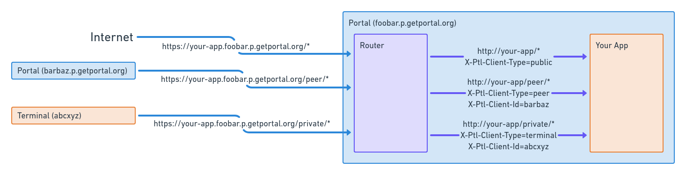

# Routing and Access Control

How to define what parts of your app can be accessed by the user, by their peers, or publicly.

---

When developing a Portal app, you generally do not have to worry about 
authentication and authorization since this is done by the Portal core software stack.
However, you do have to decide which parts of your app are

* available publicly
* can only be accessed by Portals that are peers of the current Portal
* can only be accessed by the owner of the Portal on which the app runs

