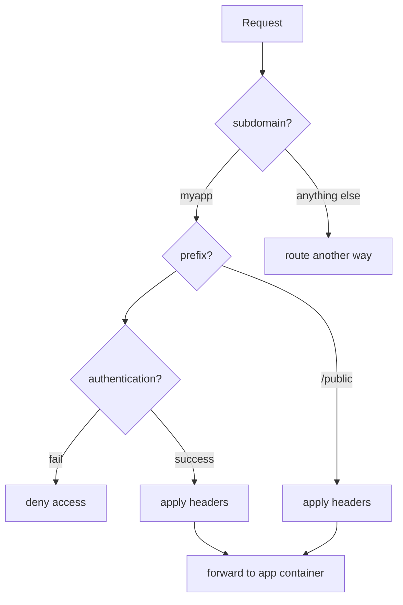

# Routing and Access Control

Incoming requests for your app are routed and authenticated by the Portal software 
according to your configuration in `app.json`.

---

## Routing

Each Portal has a unique URL containing its random six-digit identifier, e.g. `xyz123.p.getportal.org`.
Each app is reachable at a subdomain of that URL, e.g. `myapp.xyz123.p.getportal.org`.
Requests to this subdomain are forwarded to the running docker container of that app.

## SSL

As an app developer, you do not need to concern yourself with SSL and certificates.
Your app's interface only needs to be reachable via HTTP at some arbitrary port.
Portal manages its own certificate that is valid for all of its subdomains
which means it covers all of its installed apps as well.

## Access Control

Portal not only authenticates itself against incoming requests.
It also authenticates the sources of those requests if configured to do so.
By using the `paths` section in the `app.json`, you can choose
which path prefixes should have which type of access
and what should be the default access type.

Path prefixes are evaluated against the path of the incoming request from longest to shortest.
The first matching prefix is chosen and its access is applied to the request.
You _must_ include the empty string `""` as the default option that is evaluated last. 
There are two types of access that you can use:

* *public* means no access control; anyone can access this path.
* *private* means that only paired terminals may access this path; these belong to the Portal's owner.

After successful authentication, Portal adds headers to the request that you defined for that path.
You can use them inside your app for more fine-grained access control or other logic.

When defining the headers, you can use template variables contained in Jinja-like double curly braces.
Available variables are:

| variable           | description                                      | example                |
|--------------------|--------------------------------------------------|------------------------|
| `auth.client_type` | The type of client that sent the request         | `terminal` or `public` |
| `auth.client_id`   | The cryptographic ID of the connected Terminal   | `eie767w`              |
| `auth.client_name` | The user-assigned name of the connected Terminal | `my notebook`          |

In addition, you can use all variables that describe the Portal itself.

{!includes/template_vars_portal.md!}

## Example

Consider an app named *myapp* with has the `path` section in the `app.json` configured like this:
```json
"paths": {
  "": {
    "access": "private",
    "headers": {
      "X-Ptl-Client-Id": "{{ auth.client_id }}",
      "X-Ptl-Client-Name": "{{ auth.client_name }}",
      "X-Ptl-Client-Type": "{{ auth.client_type }}"
    }
  },
  "/public/": {
    "access": "public"
  }
}
```

This would lead to the access control behavior visualized below.


