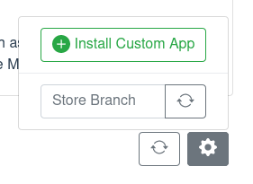

# Testing your App

To test your app, you can install it on your own Portal before submitting it to the app store.
You can also let others install and test it.

---

The app store is not the only way of installing apps.
You can also use the *Install Custom App* function under the app store options.
It lets you write or paste the app metadata - what you would normally put in the `app.json` file -
and directly install an app from it.
Refer to the [page about `app.json`](app_json.md) for details on its format.

Keep in mind that before you can install your app,
its Docker image must be published such that your Portal may pull it.

This way of installing an app manually can be done by anyone.
You can instruct friends or colleagues to install your app
so that you may test any peering features it may have.