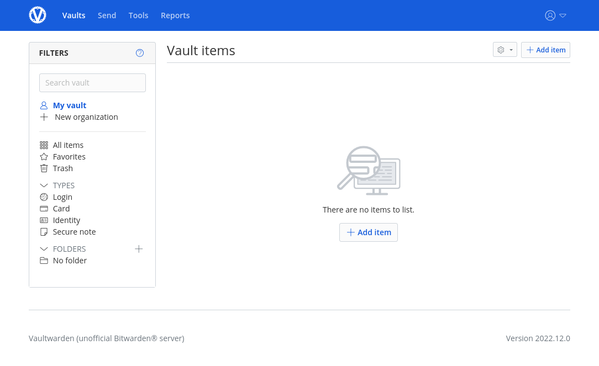

# Password Management with VaultWarden

The VaultWarden App is a feature-rich state-of-the-art password manager
that you can install with a single click on your Portal.
It allows you to have your passwords with you at all times
and keeps them secure by encrypting them at-rest with your master password.
If you use a browser plugin, it will sync with VaultWarden on your Portal
and fill login forms for your quickly and securely.

The following steps will guide you through the setup and configuration.

---

## Installation and Setup

First, Install VaultWarden like any other Portal App.

When you open the app, you must first create an account.
This is needed because VaultWarden encrypts your passwords with a master password at rest
and in order to have a master password, you need an account.

??? note "Multi-User" 
    While in theory it is possible to also let others create accounts on your VaultWarden app,
    we do not recommend it. Portal is meant to be a single-user platform and future developments
    might change access control rules and lock out the people you share the app with.

You can now log in to your account and start adding entries.
But if you used another password manager before, it might be easier to transfer the existing entries.

## Transfer passwords from previous password managers

In general, you can navigate to *Tools* and *Import data* and select your existing password manager
from the dropdown.
VaultWarden will then give you instructions on exporting the data.

### KeePass

When exporting from KeePass, open your existing password file and navigate to *File* and *Export*
and select the *KeePass XML (2.x)* option.
Chose a path for the exported data and click OK.

In VaultWarden, chose the *KeePass 2 (xml)* import format and select the file you just exported.
Then click *Import data*.

!!! warning
    Don't forget to delete the exported file after you imported it into VaultWarden!
    It contains all of your passwords in cleartext, and you don't want that just lying around.

After importing, you might want to clean up a little.
For example, the recycle bin in KeePass is imported as a normal folder in VaultWarden
and you might want to delete it.

## Browser Plugin Setup

Installing a browser plugin and connecting it to your VaultWarden app
greatly simplifies the login process and makes it more secure
by matching the URL in the browser with the URL of the password entry.

### Bitwarden Plugin for Firefox

As a Firefox user, [install the Bitwarden plugin](https://addons.mozilla.org/en-US/firefox/addon/bitwarden-password-manager/).

Open the plugin panel and instead of loggin in, open the settings by clicking on the
gear button in the top left.

Here, enter the URL of your VaultWarden app.
You can see it by opening VaultWarden on your Portal and looking at your browser's address bar.
Enter only the domain, i.e. leave out everything after `.org`.
It should look like in the screenshot only with your own Portal-ID.

Click save and login with the email and master password you set earlier.

You can now access all of your passwords directly in your browser.
If you have added URLs to the entries, the plugin will even propose and autofill
your credentials for you.
