# Smart Home with MQTT

Many smart home and IoT devices support the communication protocol [MQTT](https://mqtt.org/){target=_blank}
and can be configured to connect to an arbitrary MQTT broker on the internet.
With the right apps and setup, that broker can be your Portal.

This allows you to monitor and control your IoT devices from anywhere
and from any device you have paired.
It also provides a privacy-preserving way of consolidating your IoT devices
which might manage sensitive data.

This guide covers installation and first steps for setting up your Portal.

---

## Apps

The MQTT broker that Portal supports is [Eclipse Mosquitto](https://mosquitto.org/){target=_blank}.
Install it from the app store.

Also install [Cedalo Management Center](https://docs.cedalo.com/management-center/mc-overview){target=_blank}
which allows you to create and manage MQTT clients, their credentials and permissions.

If you want to test and monitor the raw data that flows through Mosquitto,
you can install [MQTTX](https://mqttx.app/web){target=_blank} as well.

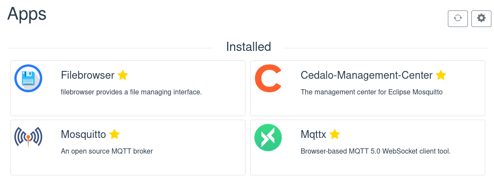

!!! bug "Known Bug"
    There is a known bug that causes app installation to sometimes fail if multiple apps are installed quickly.
    If any app refuses to start, simply uninstall and reinstall it.

## Creating Clients and Permissions

Open Cedalo Management Center and login with `admin:admin`.
(This is necessary because the app does not yet support the required authentication methods needed for Portal.)
You are greeted with a dashboard that shows you the state of your Mosquitto broker.

Navigate to *clients* and create a new client.
Give it a name and a password.
You will use this client for a first test.
Later, it is advised to create a separate client for each IoT device you connect.

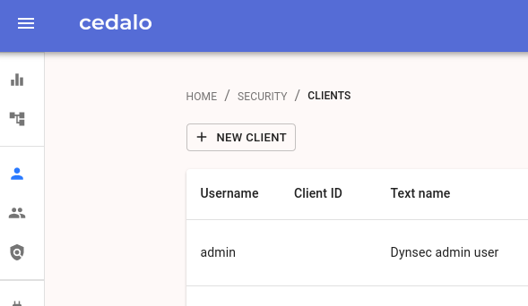
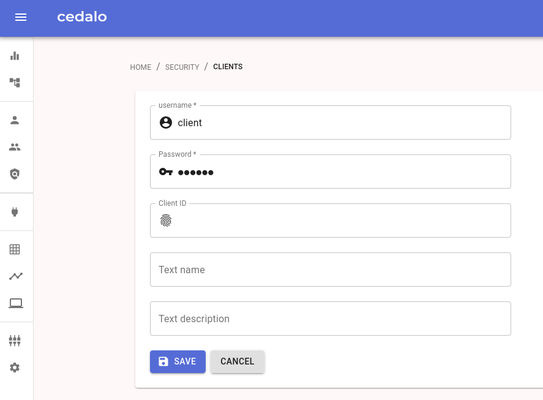

Next, navigate to *roles* and create a new role.
You only need to give it a name.
A role contains a set of permissions and in order for the client to be able to do anything,
we have to give it some permissions through that role.
So on the tab *ACLs*, add some permissions like seen in the screenshot.

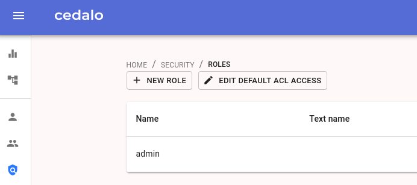
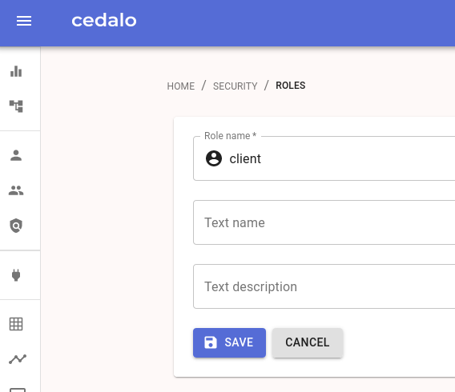
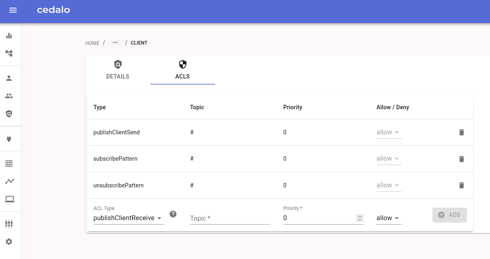

Lastly, go back to *clients* and assign the newly created and configured role to the client.
Now, the client is allowed to do all the things that were configured in the role.

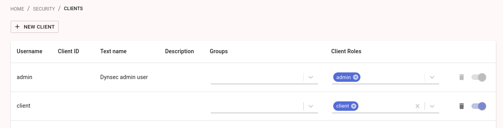

For more information about configuring access control, 
see the [Cedalo docs](https://docs.cedalo.com/management-center/mc-dynamic-security){target=_blank}
and the [Mosquitto docs](https://mosquitto.org/documentation/dynamic-security/){target=_blank}.

## Testing

You can now test the broker and its settings.
One way is by using the MQTTX app.
Install it from the app store if you have not already done so and open it.

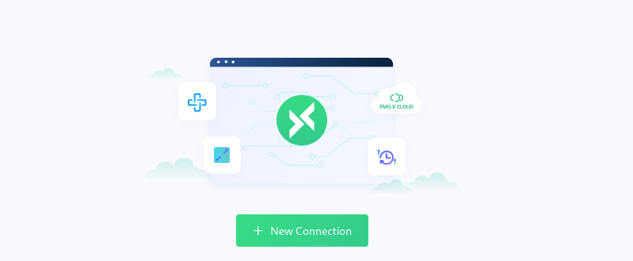

Create a new connection and enter the connection details as shown on the screenshot.
Replace the host with the URL of your Mosquitto app which is `mosquitto.<id>.p.getportal.org`
Then click connect to establish a connection with your broker.

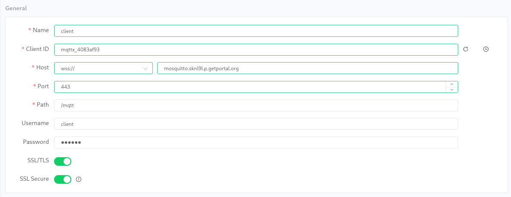

??? note "Why port 443?" 
    We are using port 443 because MQTTX only supports connections using MQTT over websocket.
    The normal MQTT port is usually 8883.
    Mosquitto offers both variants.

In order to test the connection, subscribe to the broker using a second client, e.g. the `mosquitto_sub` cli tool.
You can subscribe using the same client that you used with MQTTX.
See the screenshot for an example command.

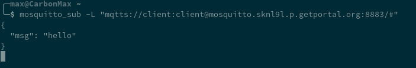

Now, send a message from MQTTX to some topic and watch `mosquitto_sub` receive it.

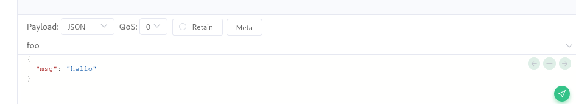

## Next Steps

With the test, you made sure that the broker works end-to-end.
Now, you can connect your smart home devices and your monitoring and automation solutions.

It is recommended to create a separate client for each device using the Cedalo Management Center
and give it the minimal permissions it needs.
Then, point the devices to `mosquitto.<id>.p.getportal.org` using either the MQTT protocol on portl 8883
or MQTT over websocket on port 443.

We will continue to work toward providing ready-made apps for many use-cases
and will release them in the future.
On the roadmap are:

* Extending the existing Node Red app to be able to connect to Mosquitto
* Adding monitoring solutions like Grafana or Prometheus
* Adding smart home dashboards like Home Assistant

If you have any other ideas or wishes,
please tell us at our [Discord server](https://discord.gg/ZXQDuTGcCf)
or using our [feedback platform](https://feedback.getportal.org/).
