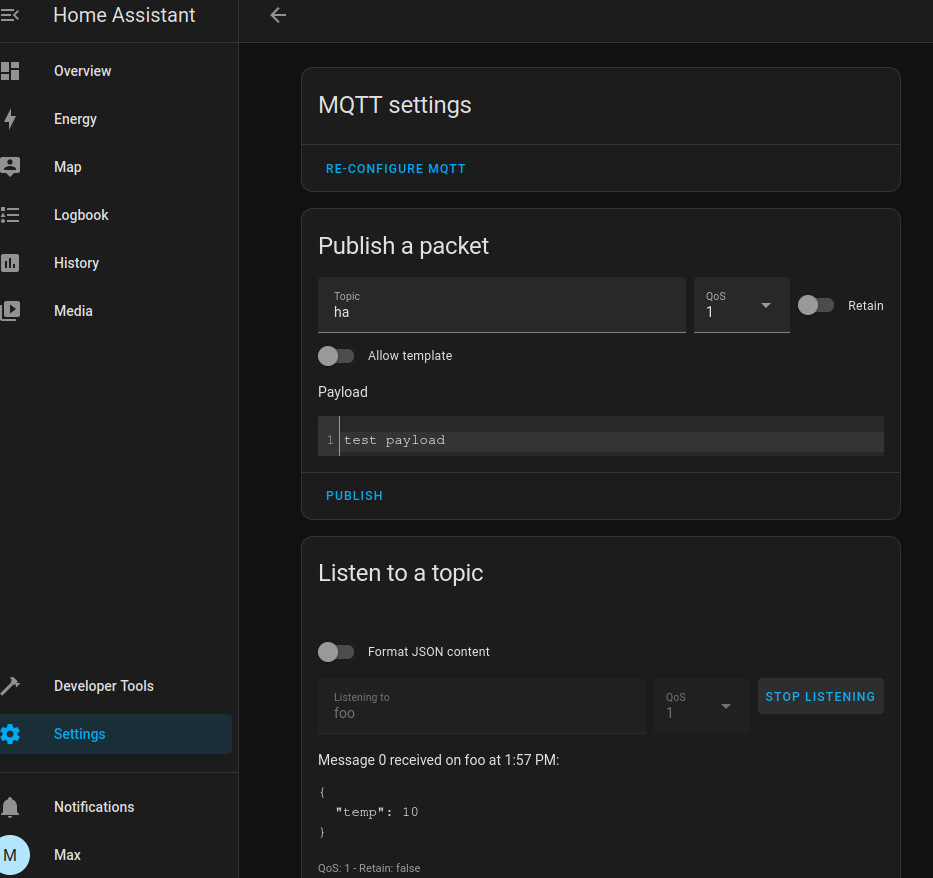

# Smart Home with MQTT

Many smart home and IoT devices support the communication protocol [MQTT](https://mqtt.org/){target=_blank}
and can be configured to connect to an arbitrary MQTT broker on the internet.
That broker can be your Portal.

This allows you to monitor and control your IoT devices from anywhere
and from any device you have paired.
It also provides a privacy-preserving way of consolidating your IoT devices
which is important if they manage sensitive data.
You can even create automation rules that act on the data.

This guide covers installation and first steps for setting up your Portal.

---

## Apps

The MQTT broker that Portal supports is [Eclipse Mosquitto](https://mosquitto.org/){target=_blank}.
Install it from the app store.

Also install [Cedalo Management Center](https://docs.cedalo.com/management-center/mc-overview){target=_blank}
which allows you to create and manage MQTT clients, their credentials and permissions.

If you want to test and monitor the raw data that flows through Mosquitto,
you can install [MQTTX](https://mqttx.app/web){target=_blank} as well.

## Creating Clients and Permissions

Open Cedalo Management Center and login with `admin:admin`.
(This is necessary because the app does not yet support the required authentication methods needed for Portal.)
You are greeted with a dashboard that shows you the state of your Mosquitto broker.

Navigate to *clients* and create a new client.
Give it a name and a password.
You will use this client for a first test.
Later, it is advised to create a separate client for each IoT device or service you connect.

Next, navigate to *roles* and create a new role and give it a name.
A role contains a set of permissions and can be assigned to clients.
This allows the clients to do the things that the assigned role permits them. 
So on the tab *ACLs*, add some permissions like seen in the screenshot.

Lastly, go back to *clients* and assign the newly created role to the client.
Now, the client is allowed to do all the things that were configured in the role.

For more information about configuring access control, 
see the [Cedalo docs](https://docs.cedalo.com/management-center/mc-dynamic-security){target=_blank}
and the [Mosquitto docs](https://mosquitto.org/documentation/dynamic-security/){target=_blank}.

## Testing

You can now test the broker and its settings.
One way is by using the MQTTX app.
Install it from the app store if you have not already done so and open it.

Create a new connection and enter the connection details as shown on the screenshot.
Replace the host with the URL of your Mosquitto app which is `mosquitto.<id>.p.getportal.org`
Then click connect to establish a connection with your broker.

??? note "Why port 443?" 
    We are using port 443 because MQTTX only supports connections using MQTT over websocket.
    The normal MQTT port is usually 8883.
    Mosquitto offers both variants.

In order to test the connection, subscribe to the broker using a second client, e.g. the `mosquitto_sub` cli tool.
For this test, you can subscribe using the same client credentials that you used with MQTTX.
See the screenshot for an example command.

Now, send a message from MQTTX to some topic and watch `mosquitto_sub` receive it.

## Automating your Home with Node Red

The [Node Red](https://nodered.org/) app allows you to easily write workflow automations
like switching devices based on sensor data.
It can connect to the Mosquitto app and consume messages (e.g. from sensors or switches)
and produce messages (e.g. to send commands to lights, power outlets, etc.).

Node Red offers two kinds MQTT nodes, one for sending, one for receiving.
When you use them, they require you to configure a MQTT server.
You need to do this only once and can reuse the same server on all MQTT nodes.

But before you begin, you should create a unique client and password for Node Red
using Cedalo Management Center.
See above on how to do this.
Give it the desired permissions, most probably the same as described above.

Then add a MQTT node to your flow and configure it.

Set up the server.
The server name is simply `mosquitto`, the port is 1883.

Also enter the credentials you created before.

Now, you can use this server to receive and send messages to create powerful automations.
Search for [node-red examples](https://duckduckgo.com/?q=node-red+examples&ia=web){target=_blank} for some inspiration.

## Monitoring and Controlling with Home Assistant

Home Assistant is a flexible and powerful tool to manage and automate the devices in your home.
It allows you to create dashboards, automations, alerts and much more.
You can install it from the Portal app store.

When first opening Home Assistant, you must create an account.
Pick a secure password: other than most Portal apps, the web interface is public.
This allows you to create accounts for other members of your household, too. 

After registration, follow the setup assistant.

It is normal that no devices are listed here.
If you install home assistant on your own hardware inside your home network,
you would see all devices that are present.
But Portal is not in your home network so this list is empty.

In order to establish a channel to your MQTT-enabled devices,
we need to connect home assistant to your Portals MQTT broker.
Navigate to _Settings > Devices & Services_.

Search for and select the MQTT option.

Like with Node-Red, the broker is simply `mosquitto` and the port is 1883.
It is good security practice to create dedicated client credentials for home assistant.
Use Cedalo management center as outlined above to do that.

You can test the connection in a similar way as before.
Use MQTTX or any other client to send and receive messages to and from home assistant.

## Next Steps

The next step is to connect smart home devices and monitor, control, and automate them.

As mentioned earlier, it is recommended to create a separate client for each device 
using the Cedalo Management Center and give it the minimal permissions it needs.
Then, point the devices to `mosquitto.<id>.p.getportal.org` using either the MQTT protocol on port 8883
or MQTT over websocket on port 443.

The smart home journey on Portal is just beginning, and we plan on adding more apps and functions in the future.
We would love to hear about your experiences, the dashboards and automations you build
and the kind of devices you connect.
Also, if you have ideas or wishes for further development, let us know
at our [Discord server](https://discord.gg/ZXQDuTGcCf){target=_blank}
or using our [feedback platform](https://feedback.getportal.org/){target=_blank}.
